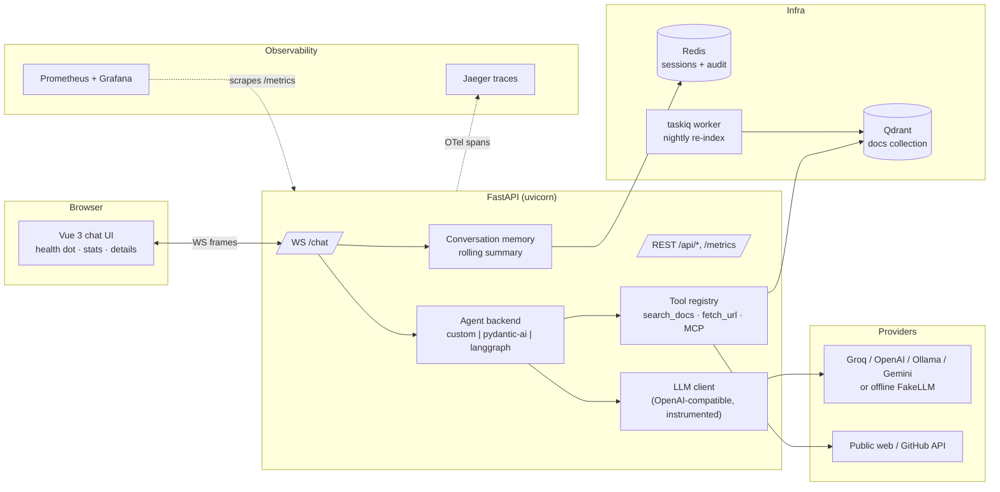

# 01 — Project overview

## What this is

**AI Workspace Assistant** — an internal AI assistant for engineers, built as
a complete, production-shaped platform rather than a demo script. It answers
questions three ways:

1. **About your systems** — RAG over an internal documentation corpus
   (architecture, service catalog, deployment, guidelines, onboarding) stored
   in Qdrant, with citations.
2. **About your code and workspace** — MCP tool servers: regex code search
   over this repository, and a GitHub server (mocked data, real tool names).
3. **About the outside world** — a `fetch_url` tool for public web pages and
   GitHub repos/accounts, so it never invents what a page contains.

Everything streams in real time over a typed WebSocket protocol into a Vue 3
chat UI, and every step of every answer is observable (chapter 07).

The UI header carries the controls that make it usable as a product rather
than a demo: a **Standard/Dev mode** toggle (chapter 07), a **Chats** panel
for reopening past conversations (chapter 08), a **Documents** panel for
filling the knowledge base at runtime (chapter 05), and a backend selector
for comparing the three agent runtimes side by side. An answer in flight can
be stopped with the **Stop** button or `Esc`.

## Architecture



## One message, end to end (the walkthrough to memorize)

User sends *"Which service generates PDF invoices?"* in the UI:

1. **WS in** — the browser sends `{"type":"user_message","content":...}` over
   `/chat`. The server assigns a 12-hex `turn_id`, binds
   `session_id`/`turn_id`/`backend` into the logging context, and opens the
   `agent.turn` span. ([ws.py](../../src/assistant/api/ws.py))
2. **Memory** — `ConversationMemory.context_for()` builds the bounded prompt:
   system prompt + rolling summary + recent verbatim turns from Redis.
3. **LLM step 1** — the agent backend calls the LLM with the message history
   and all tool schemas. `InstrumentedLLM` wraps the call (span `llm.step`,
   token usage, timing). The model answers with a *tool call*:
   `search_docs({"query": "..."})`.
4. **Tool execution** — `Tool.run` (span `tool.execute`) checks the per-turn
   duplicate guard, then runs the handler: the retriever embeds the query,
   runs hybrid dense+sparse search in Qdrant with RRF fusion (span
   `rag.retrieve`), reranks, applies the relevance gate, and returns chunk
   blocks with `[source — heading] (score)` headers. The UI shows a tool card.
5. **LLM step 2** — the tool result is appended and the model streams the
   final answer token by token (`token` frames → the UI types it out),
   citing `architecture/services.md`.
6. **Wrap-up** — the server sends the `final` frame, then a `turn` frame with
   stats (duration, first-token ms, LLM steps, real/estimated tokens, cost,
   tools used) that the UI renders under the answer; writes one `turn.summary`
   log line; increments Prometheus counters; stores the audit record in Redis.
   The whole tree is now visible in Jaeger as
   `agent.turn → llm.step → tool.execute → rag.retrieve → llm.step`.

## Repository layout

```
src/assistant/
  main.py              app factory: wiring, lifespan, /metrics, static UI
  config.py            all settings (pydantic-settings, ASSISTANT_* env vars)
  api/  ws.py          WebSocket chat: the turn conductor
        turn_recorder.py  per-turn accounting -> stats frame + audit record
        routes.py      /api/info /api/health /api/sessions/{id}/turns /api/reindex
        schemas.py     typed WS protocol (incl. TurnSummary)
  agent/ base.py       the AgentBackend contract + event types
        registry.py    settings -> {custom, pydantic_ai, langgraph}
        backends/      the three runtimes
        tools/         Tool + registry seam, search_docs, fetch_url
  llm/  client.py      OpenAI-compatible streaming client, retries, salvage
        errors.py      provider-error -> (metric kind, user message)
        fake.py        offline heuristics shared by both fake providers
  rag/  ingest.py chunking.py embeddings.py sparse.py store.py retriever.py rerank.py
  mcp/  registry.py    MCP client: connect servers, adapt tools
  mcp_servers/         bundled stdio servers: code_search, fake_github
  memory/              SessionStore (Redis), ConversationMemory, summarizer
  logs.py telemetry.py observability.py    the observability layer
  worker.py            taskiq broker + nightly re-index (cron 0 3 * * *)
frontend/              Vue 3 + Pinia + Vite chat UI
evals/corpus/          retrieval test fixture (golden-set answers live here)
observability/         Prometheus config + Grafana provisioning + dashboard
evals/                 golden set + retrieval quality + embedding comparison
tests/                 129 deterministic tests (no network, no Docker needed)
docs/                  ALL documentation (handbook, theory, reference, project)
```

## How it was built (phase history)

Phases 1–8 built the platform incrementally: WS chat + sessions → RAG →
tool-calling agent loop → MCP → the two alternative agent runtimes →
conversation memory → platform features (taskiq jobs, auth, Vue UI) → docs
and evals. Phase 9 added maximum observability (logs+correlation IDs, OTel
spans → Jaeger, /metrics + Grafana, deep health, audit trail, per-turn UI
stats), followed by provider hardening (rate-limit backoff, llama tool-call
salvage, cost accounting, `fetch_url`, retrieval relevance gate, duplicate
guard) — all verified live against Groq. Full details:
[implementation-plan.md](../project/implementation-plan.md) and [TODO.md](../project/TODO.md).

## Design principles (why it looks like this)

- **Offline-first**: everything runs with zero accounts/keys — FakeLLM, hash
  embedder, fakeredis, in-memory Qdrant in tests. Real providers are config.
- **One contract, swappable parts**: agent backends, LLM providers, embedders
  and rerankers are all config-switched implementations of small protocols.
- **Every seam observable**: the same four spans/log events/metrics wrap every
  backend and every tool — added once at the seam, not per feature.
- **Deterministic tests for nondeterministic tech**: the suite never calls a
  real model; provider quirks are reproduced with scripted fakes.
