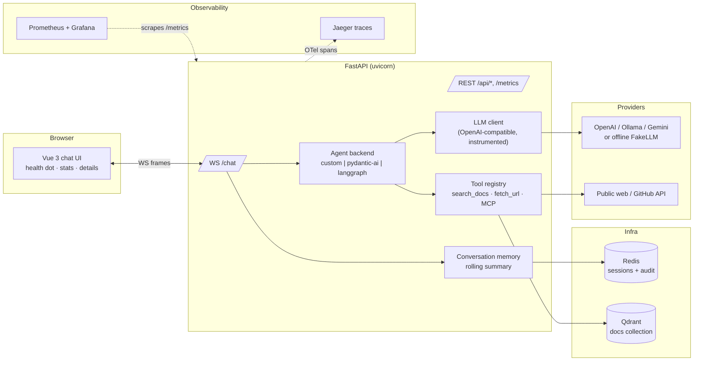

# 01 — Project overview

**What this chapter covers: what the AI Workspace Assistant is, the shape of
its architecture, what happens for one message end to end, how the
repository is laid out, and why it was built the way it was.** It does not
cover how to run it or what any setting does — see
[02 — Getting started](02-getting-started.md) for that; this page is the map
you read before the tour.

## 1. What this is

**AI Workspace Assistant** — an internal AI assistant for engineers, built as
a complete, production-shaped platform rather than a demo script. It answers
questions three ways:

1. **About your systems** — RAG over an internal documentation corpus
   (architecture, service catalog, deployment, guidelines, onboarding) stored
   in Qdrant, with citations.
2. **About your code and workspace** — MCP tool servers: regex code search
   over this repository, and a GitHub server (mocked data, real tool names).
3. **About the outside world** — a `fetch_url` tool for public web pages and
   GitHub repos/accounts, so it never invents what a page contains.

Everything streams in real time over a typed WebSocket protocol into a Vue 3
chat UI, and every step of every answer is observable (chapter 07).

The UI header carries the controls that make it usable as a product rather
than a demo: a **Standard/Dev mode** toggle (chapter 07), a **Chats** panel
for reopening past conversations (chapter 08), a **Documents** panel for
filling the knowledge base at runtime (chapter 05), and a backend selector
for comparing the three agent runtimes side by side. An answer in flight can
be stopped with the **Stop** button or `Esc`.

A concrete instance of the "never invents" rule this assistant is built
around: the system prompt in [config.py](../../src/assistant/config.py)
tells the model *"Every claim about what the knowledge base, a repository, or
any code contains must come from a tool result in the CURRENT turn — never
from memory, never from an earlier turn."* That sentence exists because of
two live failures it was written to stop: a turn that answered *"not found
in the indexed documentation"* having called no tool at all, and a turn that
invented a plausible file path, variable and formula for an ingested
repository — confidently, from nothing.
[tests/test_review_regressions.py](../../tests/test_review_regressions.py)
(`test_the_system_prompt_forbids_claiming_unavailable_actions`) pins the
sentence in place.

## 2. Architecture



## 3. One message, end to end (the walkthrough to memorize)

User sends *"Which service generates PDF invoices?"* in the UI:

1. **WS in** — the browser sends `{"type":"user_message","content":...}` over
   `/chat`. The server assigns a 12-hex `turn_id`, binds
   `session_id`/`turn_id`/`backend` into the logging context, and opens the
   `agent.turn` span. ([ws.py](../../src/assistant/api/ws.py))
2. **Memory** — `ConversationMemory.context_for()` builds the bounded prompt:
   system prompt + rolling summary + recent verbatim turns from Redis.
3. **LLM step 1** — the agent backend calls the LLM with the message history
   and all tool schemas. `InstrumentedLLM` wraps the call (span `llm.step`,
   token usage, timing). The model answers with a *tool call*:
   `search_docs({"query": "..."})`.
4. **Tool execution** — `Tool.run` (span `tool.execute`) checks the per-turn
   duplicate guard, then runs the handler: the retriever embeds the query,
   runs hybrid dense+sparse search in Qdrant with RRF fusion (span
   `rag.retrieve`), reranks, applies the relevance gate, and returns chunk
   blocks with `[source — heading] (score)` headers. The UI shows a tool card.
5. **LLM step 2** — the tool result is appended and the model streams the
   final answer token by token (`token` frames → the UI types it out),
   citing `architecture/services.md`.
6. **Wrap-up** — the server sends the `final` frame, then a `turn` frame with
   stats (duration, first-token ms, LLM steps, real/estimated tokens, cost,
   tools used) that the UI renders under the answer; writes one `turn.summary`
   log line; increments Prometheus counters; stores the audit record in Redis.
   The whole tree is now visible in Jaeger as
   `agent.turn → llm.step → tool.execute → rag.retrieve → llm.step`.

Each numbered step above is one file's job:

| # | File | Role |
|---|---|---|
| 1 | [api/ws.py](../../src/assistant/api/ws.py) | accepts the frame, assigns `turn_id`, opens `agent.turn` |
| 2 | [memory/conversation.py](../../src/assistant/memory/conversation.py) | `context_for()` — the bounded prompt: summary + recent turns |
| 3, 5 | [agent/backends/](../../src/assistant/agent/backends/)`custom.py` (or `pydantic_ai.py` / `langgraph.py`) | the loop that calls the LLM and executes tool calls |
| 4 | [agent/tools/base.py](../../src/assistant/agent/tools/base.py) | `Tool.run` — the seam every tool call passes through |
| 4 | [rag/retriever.py](../../src/assistant/rag/retriever.py) | hybrid search + RRF + rerank behind `search_docs` |
| 6 | [api/turn_recorder.py](../../src/assistant/api/turn_recorder.py) | turns the finished turn into the stats frame and the audit record |

### Seeing it happen


This is the six steps above, happening for real — turn `b099e9cd40ff`,
*"How is todometer released?"*, measured 2026-09-04:

- **`turn.start user_chars=26`** — step 1: the frame lands and the turn id is
  assigned.
- **`POST …/chat/completions`** — step 3: the model sees the tool schemas
  and answers with a `search_docs` call instead of prose.
- **`POST …/v1/embeddings`** then **`POST …/collections/docs/points/query`**
  — step 4, inside the tool: the query becomes a vector, then one Qdrant
  call does dense+sparse retrieval.
- **`rag.retrieved mode=hybrid results=4 duration_ms=1003`** — the
  retriever's own summary: retrieval took 1,003 ms of this turn.
- **`tool.executed tool=search_docs status=ok duration_ms=1018 result_chars=2012`**
  — step 4 closing: the seam adds only 15 ms over retrieval itself.
- **`POST …/chat/completions`** — step 5: the second LLM step, writing the
  cited answer.
- **`turn.summary … llm_steps=2 … cost_usd=0.000908 duration_ms=4455`** —
  step 6: 8,380 prompt and 175 completion tokens, $0.000908, 4,455 ms end to
  end. The same capture is read tool-by-tool in
  [reference/tools.md §5](../reference/tools.md).

## 4. Repository layout

```
src/assistant/
  main.py              app factory: wiring, lifespan, /metrics, static UI
  config.py            all settings (pydantic-settings, ASSISTANT_* env vars)
  api/  ws.py          WebSocket chat: the turn conductor
        turn_recorder.py  per-turn accounting -> stats frame + audit record
        routes.py      /api/info /api/health /api/documents /api/sessions/{id}/turns
        schemas.py     typed WS protocol (incl. TurnSummary)
  agent/ base.py       the AgentBackend contract + event types
        registry.py    settings -> {custom, pydantic_ai, langgraph}
        backends/      the three runtimes
        tools/         Tool + registry seam, search_docs, fetch_url
  llm/  client.py      OpenAI-compatible streaming client, retries, salvage
        errors.py      provider-error -> (metric kind, user message)
        fake.py        offline heuristics shared by both fake providers
  rag/  ingest.py chunking.py embeddings.py sparse.py store.py retriever.py rerank.py
  mcp/  registry.py    MCP client: connect servers, adapt tools
  mcp_servers/         bundled stdio servers: code_search, fake_github
  memory/              SessionStore (Redis), ConversationMemory, summarizer
  logs.py telemetry.py observability.py    the observability layer
frontend/              Vue 3 + Pinia + Vite chat UI
evals/corpus/          retrieval test fixture (golden-set answers live here)
observability/         Prometheus config + Grafana provisioning + dashboard
evals/                 golden set + retrieval quality + embedding comparison
tests/                 573 deterministic tests (no network, no Docker needed)
docs/                  ALL documentation (handbook, theory, reference, project)
```

## 5. How it was built (phase history)

Phases 1–8 built the platform incrementally: WS chat + sessions → RAG →
tool-calling agent loop → MCP → the two alternative agent runtimes →
conversation memory → platform features (auth, Vue UI) → docs
and evals. Phase 9 added maximum observability (logs+correlation IDs, OTel
spans → Jaeger, /metrics + Grafana, deep health, audit trail, per-turn UI
stats), followed by provider hardening (rate-limit backoff, llama tool-call
salvage, cost accounting, `fetch_url`, retrieval relevance gate, duplicate
guard) — all verified live against OpenAI. Full details:
[implementation-plan.md](../project/implementation-plan.md) and [future-tools.md](../project/future-tools.md).

## 6. Design principles (why it looks like this)

- **Offline-first**: everything runs with zero accounts/keys — FakeLLM, hash
  embedder, fakeredis, in-memory Qdrant in tests. Real providers are config.
- **One contract, swappable parts**: agent backends, LLM providers, embedders
  and rerankers are all config-switched implementations of small protocols —
  pinned by [tests/test_fake_parity.py](../../tests/test_fake_parity.py),
  which asserts the same prompt routes to the same tool on all three
  backends.
- **Every seam observable**: the same four spans/log events/metrics wrap every
  backend and every tool — added once at the seam, not per feature (chapter
  07 is the tour).
- **Deterministic tests for nondeterministic tech**: the suite never calls a
  real model; provider quirks are reproduced with scripted fakes.

## 7. Showing it live

About thirty seconds, no keys:

1. Start Mode A (the first command in
   [02 — Getting started §2](02-getting-started.md)) and open
   http://localhost:8000/. *"Nothing is running except this one process — no
   Docker, no API key."*
2. Send *Which service generates PDF invoices?* — *"the fake model routes on
   the trailing question mark, straight into `search_docs`."*
3. Point at the tool card while it streams, then the stats line once it
   finishes — *"same tool card, same stats line, whichever of the three
   backends the dropdown says — that's the whole point of one contract."*
4. Switch **Dev mode** on and repeat — *"same turn, now with the full JSON
   timeline instead of just the chat bubble."*

Total: well under a minute, and free to repeat as many times as a question
needs it.

## 8. Reading it honestly

- **The three-way framing is intent, not an enforced router.** Nothing stops
  the model from mixing categories in one turn (RAG plus a web fetch), and
  nothing stops it from answering all three badly; §1 describes what the
  assistant is *for*, not a dispatcher that guarantees it.
- **The diagram omits two real paths.** The MCP servers are subprocesses (or
  an HTTP connection) the tool registry talks to, not a box of their own; and
  the rolling-summary write-back into Redis (chapter 08) happens off to the
  side of the arrows drawn here.
- **"Every seam observable" has a real, once-found exception.** The Pydantic
  AI backend drives the provider through its own model layer, which bypasses
  `InstrumentedLLM` — until 2026-09-04 that meant its turns reported 0 prompt
  tokens and a cost of $0.000016 while Langfuse's own view showed roughly
  5,000 input tokens for the same call.
  [backend-comparison.md §6](../reference/backend-comparison.md) has the full
  account; the fix (`record_external_usage`) folds externally-reported usage
  into the same counters, but it is a reminder that "the same spans wrap
  every backend" is a design intent that has to be checked, not assumed.
- **"Phase history" is retrospective narrative, not an enforced structure.**
  Nothing in the repository tags commits by phase; §5 groups work the way it
  is easiest to explain, and
  [implementation-plan.md](../project/implementation-plan.md) is the actual
  per-phase record.

## 9. Related

- [02 — Getting started](02-getting-started.md) — every run mode this overview assumes, from zero infra to the full stack
- [08 — Agents, memory & WebSocket](08-agents-memory-ws.md) — the turn conductor and the three backends, in depth
- [07 — Observability](07-observability.md) — where the four spans in the walkthrough end up
- [reference/tools.md](../reference/tools.md) — the tool seam the walkthrough calls into, measured on a real turn
- [project/tech-stack.md](../project/tech-stack.md) — why each piece of this architecture was chosen, with the alternatives that lost
- [project/implementation-plan.md](../project/implementation-plan.md) — the phase history in full, not the summary
