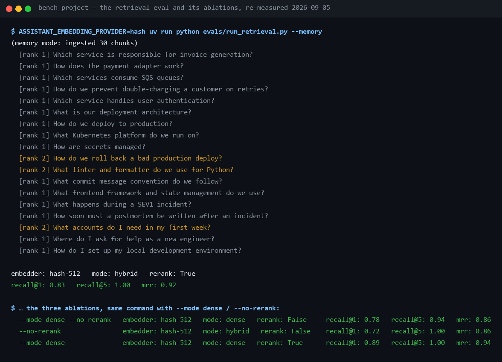

# 05 — RAG & Qdrant: how the assistant answers from *our* docs

**What this chapter covers: where the knowledge base's documents come from,
exactly what happens from a Markdown file to a stored vector and back to a
cited chunk, and the measured effect of hybrid search, reranking and the
embedder on retrieval quality.** It does not cover the `search_docs` tool's
exact argument shape or its error strings as the model sees them — see
[reference/tools.md](../reference/tools.md) for that; this page is the
pipeline behind the tool. Concept primer: [theory/03-rag.md](../theory/03-rag.md).

## 1. Where documents come from

The knowledge base **starts empty**. Documents are added at runtime:

| How | When to use |
|---|---|
| **Documents panel** in the UI header — drop files or paste text | day to day |
| `POST /api/documents` (multipart `files=` and/or `text=`+`source=`); `GET` to list, `DELETE /api/documents/{source}` to remove | scripting, CI |
| `uv run python -m assistant.rag.ingest <folder>` | bulk import |

Re-uploading a source **replaces** it rather than duplicating, because chunk
ids are derived from `(source, index)`.

`search_docs` distinguishes *nothing indexed yet* from *nothing relevant* —
they need different answers, and only the first is the user's to fix.

## 2. The eval fixture

[evals/corpus/](../../evals/corpus/) — Markdown files in three areas
(`architecture/`, `guidelines/`, `onboarding/`). Only `*.md` files under the
corpus directory are ingested; the chunk's `source` is its relative path
(that's what citations show). This is the "internal engineering
documentation" the system prompt promises.

Measured 2026-09-05, entirely offline (chunking needs no Qdrant):

```sh
uv run python -c "from pathlib import Path; from assistant.rag.ingest import load_chunks; print(len(load_chunks(Path('evals/corpus'))))"
# -> 30
```

5 files split into exactly **30** chunks — the number the ingestion pipeline
below produces and §5's retrieval table is measured against.

## 3. Ingestion pipeline (`python -m assistant.rag.ingest`)

```
*.md file ──> chunk_markdown() ──> per chunk:
                                     dense vector   (embedder, 512-dim)
                                     sparse vector  (lexical, md5-token index)
                                   ──> Qdrant upsert (deterministic ids)
```

1. **Chunking** ([rag/chunking.py](../../src/assistant/rag/chunking.py)) —
   heading-aware Markdown splitting; each chunk keeps its `source` file and
   `heading` path (both shown in citations). Code fences stay intact. The
   defaults are real function arguments, not documentation prose:
   `chunk_markdown(..., target_chars=1800, hard_limit=2400)` — paragraphs are
   packed greedily up to ~1,800 characters, and a single paragraph over 2,400
   characters is hard-split rather than left oversized.
   Deterministic chunk ids → re-running ingest overwrites in place
   (idempotent); `--recreate` drops the collection first (use it to *remove*
   stale sources).
2. **Dense embedding** ([rag/embeddings.py](../../src/assistant/rag/embeddings.py)) —
   provider-switched:
   - `hash` *(default)*: offline feature-hashing into 512 dims — zero cost,
     deterministic, good enough for lexical-ish matching; the reason the
     whole platform runs without keys.
   - `openai` (`text-embedding-3-small`) or `voyage` (voyage-3): real
     semantic embeddings; set the key and **re-ingest**.
3. **Sparse encoding** ([rag/sparse.py](../../src/assistant/rag/sparse.py)) —
   classic keyword signal: each token maps to a stable 32-bit index
   (md5-based) with sublinear term-frequency values. Identifiers are split
   into subwords too: `tokenize("completedPercentage")` yields
   `completedpercentage`, `completed`, `percentage` — which is exactly what
   lets a natural-language question about "percentage" match a chunk that
   only ever wrote the identifier.
   [tests/test_rag.py](../../tests/test_rag.py)
   (`test_identifiers_are_searchable_by_their_words`) pins it.
4. **Storage** ([rag/store.py](../../src/assistant/rag/store.py)) — one Qdrant
   collection (`docs`) with **named vectors** `dense` (cosine) + `sparse`;
   payload carries text/source/heading.

Three ways to (re)ingest:

| How | When |
|---|---|
| `uv run python -m assistant.rag.ingest <folder> [--recreate]` | CLI, always works |
| same, in `fakeredis://` mode | runs inline in the request |

## 4. Query pipeline (what `search_docs` actually does)

```
query ──> embed (dense) ──> Qdrant hybrid search ──> RRF fusion (server-side)
      └─> encode (sparse) ─┘        top-20 candidates
                                        │
                              LexicalReranker (token overlap)
                                        │  top-4
                              relevance gate (query_overlap > 0)
                                        │
                       "[source — heading] (score 0.87)\n<chunk>" blocks
```

- **Hybrid + RRF** ([rag/retriever.py](../../src/assistant/rag/retriever.py)):
  dense and sparse searches run as one Qdrant query; Reciprocal Rank Fusion
  merges the two rankings. `ASSISTANT_RETRIEVAL_MODE=dense` disables sparse.
  The over-fetch is a real constructor default, `fetch_limit: int = 20`
  ([rag/retriever.py](../../src/assistant/rag/retriever.py)) — 20 candidates
  reach the reranker even though `search_docs` only ever asks for the top 4;
  reordering needs a wider net than the final answer does.
- **Rerank** ([rag/rerank.py](../../src/assistant/rag/rerank.py)): deterministic
  lexical reranker reorders the top-20 by meaningful-token overlap with the
  query (stopwords ignored), retrieval score as tie-break. Offline stand-in
  for API rerankers (voyage/cohere slot into the same protocol). Pinned by
  [tests/test_rag.py](../../tests/test_rag.py)
  (`test_lexical_reranker_orders_by_overlap`,
  `test_hybrid_exact_token_match_ranks_first`).
- **Relevance gate** (`query_overlap`, applied in the tool): retrieval always
  returns top-k *even for garbage queries*, and RRF/hash scores are not
  calibrated — so chunks sharing **no** meaningful token with the query
  (prefix-tolerant: "deploy" matches "deployment") are dropped. If nothing
  survives, the model receives the live inventory of what *is* indexed, any
  indexed filenames sharing a token with the query, and a retry contract:
  try up to two *different* phrasings, then report what was searched — never
  claim something does not exist. (The earlier "do not retry" text taught the
  model to surrender after one literal miss and to assert code was absent
  when it existed; only the *empty knowledge base* case still says "do not
  retry — upload documents".) This is the fix for confident-looking
  irrelevant results *and* for confident-looking absence.
- Every retrieval emits: span `rag.retrieve` (mode, candidates, results, top
  score), log `rag.retrieved` (with `top_source`), histogram
  `assistant_retrieval_seconds{mode}`.

## 5. Measured quality (golden set)

18 golden questions ([evals/golden.yaml](../../evals/golden.yaml)), hash-512
embedder — re-measured 2026-09-05
(`ASSISTANT_EMBEDDING_PROVIDER=hash uv run python evals/run_retrieval.py --memory`,
and the same command with `--mode dense` / `--no-rerank`), each pipeline
stage earning its place:

| config | recall@1 | recall@5 | MRR |
|---|---:|---:|---:|
| dense only, no rerank | 0.78 | 0.94 | 0.86 |
| hybrid (RRF), no rerank | 0.72 | 1.00 | 0.86 |
| dense + rerank | 0.89 | 1.00 | 0.94 |
| hybrid + rerank *(default)* | **0.83** | **1.00** | **0.92** |



Line by line (the same capture is [metrics.md §5](../reference/metrics.md)'s):

- **`[rank 1] What happens during a SEV1 incident?`** — one line per golden
  question, with the rank at which the expected chunk appeared. Fifteen of
  eighteen are `[rank 1]`.
- **`[rank 2] What accounts do I need in my first week?`** — one of the
  three questions whose answer came second.
- **`embedder: hash-512   mode: hybrid   rerank: True`** — the configuration
  being scored; check it before trusting a number, because `.env` can change
  it.
- **`recall@1: 0.83   recall@5: 1.00   mrr: 0.92`** — the default row of the
  table above, reproduced to the digit on 2026-09-05.

Read that honestly: **the rerank is what earns its place** (+0.11 recall@1,
and it is the only stage that moves MRR much). Sparse fusion pays for
recall@5 — every question lands in the top 5 — but on recall@1 dense+rerank
is one question ahead of the default. One question out of 18 is noise, and
the two configurations disagree in opposite directions: hybrid wins the
lexical-gap question ("linter/formatter" vs the docs' "lint/format", rank
3 → 2), dense wins "what accounts do I need in my first week" (rank 1 → 2).

Hybrid stays the default because sparse vectors are insurance against
vocabulary mismatch that costs nothing at query time, and because this
ablation cannot really separate the two signals: `hash-512` is a *lexical*
hash, so "dense" here is already keyword-ish. With a real semantic embedder
the two channels diverge and the fusion matters more — which is exactly what
`evals/compare_embeddings.py` is there to measure.

Reproduce: `uv run python evals/run_retrieval.py --memory` (no Docker
needed). Compare embedders: `uv run python -m evals.compare_embeddings` →
writes [evals/results-embeddings.md](../../evals/results-embeddings.md).

### What a real embedder buys — measured

The offline `hash-512` embedder is a *lexical* hash, so it cannot match
wording it has never seen. Swapping in a semantic model, same corpus, same
18 questions, same hybrid+rerank pipeline:

| embedder | recall@1 | recall@5 | MRR | cost |
|---|---:|---:|---:|---|
| `hash-512` (offline default) | 0.83 | 1.00 | 0.92 | $0 |
| `text-embedding-3-small` | **0.94** | 1.00 | **0.97** | fractions of a cent |

Three of the questions the hash embedder ranked second or third move to
first place. That is the vocabulary-mismatch gap closing: the semantic model
matches *meaning*, so a question phrased with different words than the
document still lands. It also reframes the hybrid-vs-dense ablation — with a
lexical stand-in for the dense channel, dense and sparse were measuring
nearly the same thing, which is exactly why that comparison was so close.

Set `ASSISTANT_EMBEDDING_API_KEY` and re-run `compare_embeddings` to
reproduce; the table regenerates itself.

## 6. Watching Qdrant itself

- **Web UI**: http://localhost:6333/dashboard → collection `docs` → browse
  points (text, source, heading payloads), vector config, count.
- **API**: `curl localhost:6333/collections/docs` → status, `points_count`
  (30 for the clean corpus), vector schema.
- **From the app**: `/api/health` pings Qdrant with a count query and
  reports latency + points; the UI health dot turns amber if it's down.
- If Qdrant is down, `search_docs` returns an error *result* (the turn
  survives — `assistant_tool_calls_total{status="crash"}` counts it).

## 7. Gotchas learned in live testing

- **Don't ingest unrelated repos into `docs`** — everything in the collection
  is treated as "our internal docs" by the system prompt. (A test repo's
  Chinese README once ended up in answers this way.) Recover with
  `... ingest <folder> --recreate`.
- **Changing embedder = re-ingest** — vectors from different embedders are
  incompatible; `--recreate` to switch cleanly.
- The displayed `(score 0.87)` is the *retrieval* score (RRF/cosine), kept
  for debugging; relevance decisions use lexical overlap, not that number.

## 8. Showing it live

Under a minute, in the UI (Mode A is enough —
[02 — Getting started §2](02-getting-started.md)):

1. Open the Documents panel and paste a short paragraph naming something
   invented, e.g. *"The zephyr-relay service retries failed webhooks four
   times."*, with a source name. *"Watch it become searchable immediately —
   no batch job, no re-index button; that button was removed once ingestion
   moved to upload time (chapter 03 §7)."*
2. Ask *What does zephyr-relay do?* — *"the tool card shows `search_docs`,
   and the answer cites exactly the source you just named."*
3. Ask about something never uploaded — *"the model gets the live inventory
   and a retry contract instead of a confident guess. That's the difference
   between 'nothing indexed' and 'nothing relevant' — and why the answer
   says what it searched instead of asserting the thing does not exist."*

## 9. Troubleshooting

| Symptom | Cause | Fix |
|---|---|---|
| `error: the 'query' argument is required` | the model called `search_docs` with no `query` | rare; the model recovers on its own next step |
| `The knowledge base is empty — no documents have been added yet. …` | nothing has been ingested yet in this environment | add documents (Documents panel, `POST /api/documents`, or the ingest CLI) |
| `No relevant chunks matched this exact wording.` plus an inventory list | the relevance gate found no meaningful token overlap with anything indexed | expected for an out-of-scope question; rephrase, or read the printed inventory for what *is* indexed |
| `error: tool 'search_docs' failed: …` | the handler raised — Qdrant unreachable is the usual cause | check `docker compose up -d` and the `qdrant` component of `/api/health` |
| `503 no document store configured (is Qdrant reachable?)` from `/api/documents` | no vector store was wired up for this runtime (an injected backend with no retriever) | the normal app startup path always builds one; this only shows up in a misconfigured test-style setup |

## 10. Reading it honestly

- **The relevance gate is lexical, not semantic.** `query_overlap` requires a
  shared token (prefix-tolerant); a question that means the same thing in
  different words with no shared token at all is gated out even though
  hybrid search might have ranked it reasonably. This trades recall for
  precision on questions the 18-question golden set does not happen to
  contain.
- **`hash-512` is not a real embedding model.** It is feature hashing, not
  semantics — the "what a real embedder buys" comparison in §5 exists
  precisely because this default cannot match paraphrase.
- **Single-label scoring.** Each golden question has one `expect_source`, so
  a question whose answer is spread across chunks scores on the first one
  found ([metrics.md §8](../reference/metrics.md)).
- **The corpus is small and hand-written.** 5 files, 30 chunks, 18 questions
  written by one author — hand-written questions reuse the documents' own
  vocabulary and make retrieval look better than real users will.
- **Reranking is O(top-20) per query, in Python, single-process.** Fine at
  this scale; nothing here has been measured at a corpus large enough for
  that to matter.

## 11. Related

- [reference/tools.md](../reference/tools.md) — `search_docs`'s exact parameters, return shape and errors as the model sees them
- [reference/metrics.md](../reference/metrics.md) — every retrieval and generation number, reproduced
- [reference/ragas.md](../reference/ragas.md) — whether the model told the truth about what it retrieved
- [02 — Getting started](02-getting-started.md) — the four ways to fill the knowledge base
- [theory/02 — Embeddings & vector search](../theory/02-embeddings-and-vector-search.md) — the concepts this chapter assumes
- [theory/03 — RAG](../theory/03-rag.md) — the concept primer, one level up from this page
