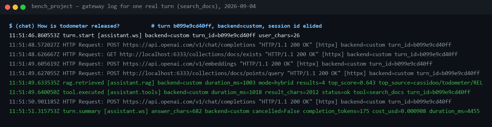
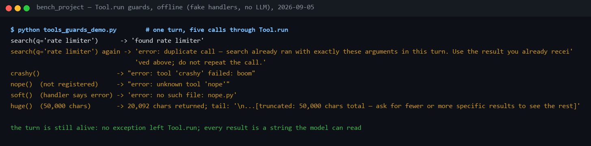

# 06 — Tools & MCP: what the agent can *do*

**What this chapter covers: the tool inventory, how one call executes through
the shared seam and its guards, how MCP servers connect and degrade, who
decides to call a tool, and how to add a new one.** It is not the per-tool
parameter-and-failure-mode reference — that is
[reference/tools.md](../reference/tools.md), measured on real turns; this
chapter is the operator's map of the machinery underneath it.

## 1. The inventory (9 tools, 2 origins)

| Tool | Origin | One line |
|---|---|---|
| `search_docs` | native | Hybrid RAG over the knowledge base (chapter 05): uploaded docs **and every ingested repo — documentation and code**. Cites `[source — heading]`; on a code hit it hands the model the exact `repo_read_file` call |
| `repo_read_file` | native | One exact file from any GitHub repo — tokenless for public repos; the "show me the real code" tool |
| `ingest_repo` | native | **The one write tool**: "ingest owner/name" pulls a repo's docs (and with `include_code`, its source files) into the KB as `owner/repo/path` sources. Additive only, explicit-ask only — both pinned by tests |
| `fetch_url` | native | Public web pages (HTML→text) and GitHub: repo URL → description+README via API, account URL → public repo list. The "never guess a page's content" tool |
| `code__search_code` | MCP `code` server | Case-insensitive regex over **this** repository (pure Python walker; respects text extensions, skips build dirs) |
| `code__read_file` | MCP `code` server | Read a file from this repository (path-escape guarded, windowed by lines) |
| `github__list_pull_requests` | MCP `github` server (**mock**) | 5 canned PRs, filterable by state |
| `github__get_pull_request` | MCP `github` server (**mock**) | One PR with body + review status |
| `github__list_issues` | MCP `github` server (**mock**) | 3 canned issues |

A worked example of the mock, exactly as shipped in
[mcp_servers/fake_github.py](../../src/assistant/mcp_servers/fake_github.py):
`github__list_pull_requests(state="open")` returns, among others,

```
#142 [open] feat(agent): LangGraph backend behind the config switch — by o.kovalenko, CI passing, 1 approval, 1 review pending, updated 2026-08-04
```

— static data, not a live repository, which is what makes the dev profile
free and deterministic. `tests/test_mcp.py`'s
`test_stdio_servers_expose_namespaced_tools_and_execute` spawns the real
subprocess and asserts `"#142"` and `"LangGraph backend"` come back, so this
line is pinned, not just documented.

### Swapping in the real GitHub server

The mock borrows the official server's names, and the swap really is just the
`ASSISTANT_MCP_SERVERS` JSON plus a PAT (see `.env.example`) — **zero code
changes**. Verified by pointing this project's own `MCPRegistry` at
`ghcr.io/github/github-mcp-server`: it connected and discovered its tools,
correctly namespaced as `github__*`.

Two things that measurement turned up, both worth knowing before you swap:

- **One name has drifted.** `list_pull_requests` and `list_issues` still
  match, but the official server renamed `get_pull_request` to
  `pull_request_read`. Nothing breaks — tools are *discovered* at startup, not
  hardcoded — but the mock is no longer a name-for-name stand-in.
- **It exposes 44 tools, against the mock's 3.** Their JSON schemas are
  ~12,900 tokens, versus ~260 for the mock, and that rides in *every* prompt
  before the user has asked anything. On a small model that measurably hurts
  tool selection; on a free tier it alone can exceed a 12k
  tokens-per-minute allowance for `gpt-4.1-nano`. Use the server's
  toolset flags (`--toolsets pull_requests,issues`) to trim it if you swap —
  which is exactly what the production `.env` does, restricting the hosted
  server to 9 tools with `X-MCP-Toolsets: pull_requests,issues`
  ([reference/tools.md §1](../reference/tools.md)).

That cost is the real argument for the mock in *development*, and it is a
better answer than "we didn't have a token": the mock proves the
*architecture* — discovery, namespacing, graceful degradation — at 3 tools
instead of 44, for free, in CI, with no credentials.

It is not the answer for a demo. The mock is the development profile; the
production profile runs the real server. See
[demo-runbook.md](../project/demo-runbook.md) and
[`.env.production.example`](../../.env.production.example).

### Two ways to connect the real one

| | Hosted (`transport: http`) | Container (`transport: stdio`) |
|---|---|---|
| Endpoint | `https://api.githubcopilot.com/mcp/` | `ghcr.io/github/github-mcp-server` |
| Needs Docker | no | yes |
| Auth | `Authorization: Bearer <PAT>` header | `GITHUB_PERSONAL_ACCESS_TOKEN` env |
| Trim toolsets | `X-MCP-Toolsets` header, `/readonly` path | `GITHUB_TOOLSETS` env |

The hosted route needs authentication headers, which is why `MCPServerConfig`
carries a **`headers`** field ([config.py](../../src/assistant/config.py)):
without it the `http` transport can only reach unauthenticated servers, so the
hosted GitHub server was unreachable regardless of the PAT. The headers become
an `httpx` client handed to the transport in
[`MCPRegistry._connect`](../../src/assistant/mcp/registry.py), and
`tests/test_mcp.py`'s `test_http_transport_sends_auth_headers` asserts the
credential actually reaches the wire — with a fake transport that raises on
purpose right after capturing it, so the test needs no real server.

## 2. How a tool call executes (the seam)

Four guards live on this one seam, so every tool — native or MCP, any
backend — gets them for free: crash isolation (a tool exception becomes an
`error:` *result*), the duplicate-call guard, telemetry (span + metrics +
log), and a **20k-char cap on the result** before it re-enters the prompt —
tool output is billed prompt tokens, and an uncapped listing once cost 57x a
normal turn.

Every call — from any of the three backends — funnels through **`Tool.run`**
([agent/tools/base.py](../../src/assistant/agent/tools/base.py)):

```
model emits tool_call
  └─ registry.execute(name, args)        unknown name -> "error: unknown tool"
       └─ Tool.run(args)
            1. duplicate guard      same (tool,args) this turn? -> pointer msg
            2. span tool.execute    + timing histogram
            3. handler(args)        crash -> "error: tool X failed: ..." RESULT
            4. metrics + log        tool_calls_total{tool,status}, tool.executed
       └─ result string appended to the conversation -> next LLM step
```

Three properties to remember:

- **A tool can never kill a turn.** Exceptions become error *results* the
  model can react to (`status="crash"` in metrics). Qdrant down → the agent
  apologizes about docs but the socket keeps serving.
- **Duplicate-call guard** — models (llama especially) sometimes repeat the
  exact same call in one turn; we measured 3× the same `fetch_url`, 31 s and
  15k tokens. A per-turn `(tool, canonical-args)` set (carried on the turn's
  `TurnStats` ContextVar) answers repeats with *"you already ran this — use
  the earlier result"* (`status="duplicate"`). Fresh turn → fresh set.
- **Statuses**: `ok` | `error` (handler said `error:`) | `crash` (raised) |
  `duplicate` | `unknown` — all visible in
  `assistant_tool_calls_total{tool,status}` and the `tool.executed` log.

**A worked example, from the gateway log of a real turn** (2026-09-04, turn
`b099e9cd40ff`, question *"How is todometer released?"*, also read line by
line in [reference/tools.md §5](../reference/tools.md)): the first LLM step
returned a `search_docs` call; inside `Tool.run` the retriever spent
1,003 ms, most of it the embeddings request; the tool result was 2,012
characters, and `tool.executed` logged `duration_ms=1018` — 15 ms of seam
overhead over the retrieval itself. Two LLM steps, one tool call, 4,455 ms
end to end, first token at 4,048 ms, 8,380 prompt and 175 completion tokens,
$0.000908.

The 20k-char cap traces back to a real incident, not foresight: one PR
listing against a busy repository returned a 149,318-token prompt —
$0.0154 for one question, many times a normal turn's cost — and after the
cap the same question cost 14,147 tokens, $0.00149.

**How each backend reaches the seam.** The custom loop passes `registry.specs`
to the LLM and executes `ToolCallRequest`s via `registry.execute`
([backends/custom.py](../../src/assistant/agent/backends/custom.py) — a
`for _ in range(self._max_iterations)` loop, `max_iterations` defaulting to
**6**; the model exhausting it gets back "I hit the tool-call limit for one
turn without reaching a final answer. Please rephrase or narrow the
question."). Pydantic AI wraps each registry tool with `Tool.from_schema`,
whose handler calls `tool.run`. LangGraph binds the same tools through its
chat-model adapter. Same seam, same log line, same span, three runtimes.

## 3. How MCP wiring works

At startup, [`MCPRegistry`](../../src/assistant/mcp/registry.py):

1. reads `ASSISTANT_MCP_SERVERS` (default: the two bundled servers, spawned
   as stdio subprocesses; `{python}` resolves to the current interpreter so
   any venv works);
2. connects each (15 s timeout), calls `list_tools`, and wraps every remote
   tool as a registry `Tool` named `<server>__<tool>` — backends can't tell
   MCP tools from native ones (60 s per-call timeout);
3. an unreachable server is logged and **skipped** — the agent runs with
   whatever connected (`/api/health`'s `mcp` block — `tools`,
   `servers_connected: "N/M"`, and `unreachable` when something failed —
   shows what's live).

Transport can also be `http` (streamable-HTTP URL) for remote servers. The
dev default, unset, is exactly the two lines `.env.example` comments out:

```sh
# ASSISTANT_MCP_SERVERS='[{"name":"code","command":"{python}","args":["-m","assistant.mcp_servers.code_search"]},{"name":"github","command":"docker","args":["run","-i","--rm","-e","GITHUB_PERSONAL_ACCESS_TOKEN","ghcr.io/github/github-mcp-server"],"env":{"GITHUB_PERSONAL_ACCESS_TOKEN":"ghp_..."}}]'
```

A worked example of graceful degradation, pinned offline by
`tests/test_mcp.py`'s `test_unreachable_server_degrades_gracefully`: pointing
`MCPRegistry` at `MCPServerConfig(name="broken",
command="definitely-not-a-real-binary-xyz")` returns `tools == []` rather
than raising — `registry.start()` swallows the connect failure, logs it, and
the caller never sees an exception. The companion `code__search_code` call in
the same test file greps *this* repository for `class CustomAgent` and gets
`custom.py` back, proving the bundled server really walks the live source
tree rather than a fixture copy of it.

## 4. Who decides to call a tool?

- A **real model** picks from the tool descriptions (that's why descriptions
  are written as instructions: *"Search the INTERNAL engineering
  documentation only … use fetch_url for external URLs"*), steered by the
  system prompt ([config.py](../../src/assistant/config.py)): search_docs first
  for internal questions, fetch_url for URLs, never invent page content,
  retry a fruitless search with *different* terms then report what was
  searched — never claim something does not exist, and never claim a search
  that was not made this turn.
- **FakeLLM** (offline) uses keyword heuristics — PR words → github tool,
  `search code for X` → code tool, any URL → fetch_url, trailing `?` →
  search_docs — so every tool is demoable with zero keys.

## 5. Adding a tool (two ways)

- **Native**: build a `Tool(name, description, JSON-schema params, async
  handler -> str)` (prefix failures with `error:`), append it in
  `native_tools` in `build_runtime()`. Telemetry, guards, and all three backends
  come free.
- **MCP**: write `@mcp.tool()` functions on a `FastMCP` server (docstring =
  description, type hints = schema — see
  [code_search.py](../../src/assistant/mcp_servers/code_search.py)), add the
  server to `ASSISTANT_MCP_SERVERS`. Or point at any existing MCP server.

## 6. How to see it



Line by line:

- **`turn.start user_chars=26`** — the turn opens; every following line
  carries the turn id.
- **`POST …/chat/completions`** — LLM step 1: the model saw the tool schemas
  and answered with a `search_docs` call, not prose.
- **`POST …/v1/embeddings`** then **`POST …/collections/docs/points/query`**
  — inside the tool: the query becomes a vector, then exactly one Qdrant
  call (dense and sparse prefetches fused server-side).
- **`rag.retrieved mode=hybrid results=4 duration_ms=1003`** — the
  retriever's own summary.
- **`tool.executed tool=search_docs status=ok duration_ms=1018 result_chars=2012`**
  — the seam closing, the numbers quoted in §2.
- **`POST …/chat/completions`** — LLM step 2, writing the answer, then
  **`turn.summary … cost_usd=0.000908 duration_ms=4455`**.



Line by line:

- **`search(q='rate limiter')` → `'found rate limiter'`** — a normal call.
- **The same call again → `error: duplicate call — search already ran with
  exactly these arguments in this turn…`** — the guard answers from the
  turn's memory; the handler never ran a second time.
- **`crashy()` → `"error: tool 'crashy' failed: boom"`** — the handler raised
  `RuntimeError("boom")`; the model receives a string, the log gets a
  `tool.crashed` warning with the traceback, and the turn goes on.
- **`nope()` → `"error: unknown tool 'nope'"`** — a name the model invented,
  counted under the label `<unregistered>` so a hallucination never mints a
  metric series.
- **`huge()` → 20,092 characters, ending `...[truncated: 50,000 chars
  total — ask for fewer or more specific results to see the rest]`** — the
  cap, with the exact marker text from
  [agent/tools/base.py](../../src/assistant/agent/tools/base.py).

Both captures are real, offline runs, not mockups; each of these guards is
also pinned by an assertion in
[tests/test_tool_loop.py](../../tests/test_tool_loop.py) and
[tests/test_review_regressions.py](../../tests/test_review_regressions.py) —
see [reference/tools.md §6](../reference/tools.md) for which test proves
which line.

## 7. Showing it live

Offline, about a minute, no keys:

1. Start the app with the fake provider (§4 of
   [09 — Testing & operations](09-testing-operations.md)) and open
   http://localhost:8000/ in **Dev** mode.
2. Type *Show latest PRs* — *"the fake model routes on keywords; the tool
   card shows the mocked GitHub server answering over MCP, PR #142 among
   them."*
3. Type *search code for rate limiter* — *"the real code server, a
   subprocess speaking MCP over stdio, grepping this repository live."*
4. Point at the stats line: *"same seam, same numbers, whichever backend the
   dropdown says — that's chapter 8."*

With the real profile, one question shows the two-tool chain: *"Which files
describe how todometer is released?"* — `search_docs` finds the chunk, the
result's trailer tells the model to open the file, `repo_read_file` fetches
it, and the answer quotes it. Three LLM steps, $0.0015, about five seconds
([reference/tools.md §7](../reference/tools.md)).

## 8. Reading it honestly

- **Descriptions steer, and a sentence can misroute a tool.** `search_docs`'
  description once said it "knows nothing about GitHub repositories", and the
  model stopped searching ingested repositories until the sentence was
  removed (measured 2026-09-04,
  [reference/tools.md §8](../reference/tools.md)). The description is a
  prompt; treat edits to it as behaviour changes and test them with a real
  model, not just offline.
- **The duplicate guard is exact-match only.** A retry with a rephrased
  query is a new call, by design — the retry contract asks for different
  terms — so a model looping through synonyms is bounded by the six-step
  limit, not by the guard.
- **The cap loses data.** A 20,000-character cut through a large file means
  the model never saw the rest; the marker asks for a narrower request, but
  `repo_read_file` has no way to ask for a window yet.
- **The mock is a mock.** In the dev profile every `github__*` answer is
  canned, and one of its three names (`get_pull_request`) has already
  drifted from the upstream server's (`pull_request_read`) — nothing breaks
  because tools are discovered, not hardcoded, but it is a reminder that the
  mock proves the architecture, not the vendor's current contract. That
  proof is the production profile's health check listing 9 real tools.
- **Timeouts are generous.** A hung MCP call holds a turn for up to 60 s
  before the seam gives up; a hung server costs 15 s at startup, serially
  per server, so a deployment with several slow servers pays for each one.

## 9. Troubleshooting

| Symptom | Cause | Fix |
|---|---|---|
| `error: unknown tool 'x'` in a tool card | the model invented a tool name, or the server that provides it did not connect | check the startup log and `GET /api/health`'s `mcp.servers_connected` |
| `servers_connected: "1/2"` in `/api/health` | an MCP server failed to start or authenticate within the 15 s connect timeout | for the hosted GitHub server, check the PAT and the `X-MCP-Toolsets` header in `ASSISTANT_MCP_SERVERS` |
| `error: duplicate call — … already ran with exactly these arguments` | the model repeated a call; the guard answered instead of re-running it | cosmetic — the model continues with the earlier result |
| `error: tool 'search_docs' failed: …` | the handler raised; the message carries the exception | check `tool.crashed` in the log for the traceback; Qdrant down is the usual cause |
| `...[truncated: N chars total — ask for fewer or more specific results …]` | the 20k-char cap fired (`TOOL_RESULT_MAX_CHARS`) | ask for a narrower query or a smaller listing |
| A tool call hangs for up to 60 s then errors | the per-call MCP timeout expired — native tools have no such ceiling | check the server process or network; the timeout itself is not configurable without a code change |

## 10. Related

- [reference/tools.md](../reference/tools.md) — every tool's exact parameters, return shape and failure text, and the guards shown failing on purpose
- [handbook/05 — RAG & Qdrant](05-rag-qdrant.md) — everything behind `search_docs`, the tool this chapter's inventory leads with
- [reference/security.md](../reference/security.md) — the SSRF guard, the path jail, and the allowlist argument for why the model can only reach these 9 tools
- [handbook/08 — Agents, memory & WebSocket](08-agents-memory-ws.md) — the three backends that all reach `Tool.run` through the same seam
- [tests/test_mcp.py](../../tests/test_mcp.py) — the guards and the graceful-degradation claims in this chapter, each reproduced against real subprocesses
