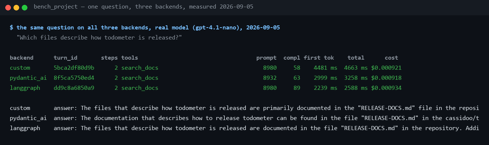

# Agent backend comparison — custom loop vs Pydantic AI vs LangGraph

**Three runtimes behind one protocol, one tool registry and one test suite:
what each costs in code, what it inherits or re-implements, how the same
question runs on all three, and which to pick for what — measured, not
argued.** For how an agent loop works at all see
[theory/04](../theory/04-tool-calling-and-agents.md); for the frameworks'
philosophies see [theory/05](../theory/05-agent-frameworks.md). This page is
the comparison, measured on 2026-09-05.

## 1. What the comparison is

All three backends implement the same `AgentBackend` protocol, receive the
same `ToolRegistry` (native tools plus MCP-adapted ones), emit the same
`AgentEvent` stream, and pass the same WebSocket test suite, parametrized
×3. The UI switches between them per session with a dropdown (`?backend=`
on the socket). That controlled setup is what makes the comparison honest:
everything below differs *only* because of the framework.

| | custom loop | Pydantic AI | LangGraph |
|---|---:|---:|---:|
| Backend file, lines (`wc -l`, docstrings included) | **98** | **286** | **278** |
| Inherits the shared provider hardening in `llm/client.py` | yes | **no — re-implemented** | yes, through the adapter |
| Of which framework-adapter code | 0 | ~45 (`FunctionModel` fake) + ~25 (model builder) | ~95 (`BaseChatModel` adapter) + ~35 (message conversion) |
| Extra runtime dependencies | none | `pydantic-ai` and its provider SDKs | `langgraph`, `langchain-core` |
| Offline fake | free — `FakeLLM` speaks our protocol | a `FunctionModel` twin sharing `llm/fake.py` | free — the adapter runs `FakeLLM` unchanged |
| Loop bound | a hand-written `for` over 6 iterations | framework-internal | `recursion_limit` → `GraphRecursionError` |
| Reports real token usage | yes, via `InstrumentedLLM` | yes since 2026-09-04, from the run's usage | yes, via the adapter |

For fairness: the custom loop leans on the shared `llm/client.py` (482
lines including the provider-hardening layer), but that file also serves
LangGraph through the adapter, the dev fake and the test scripting, so it is
not a custom-loop-only cost.

## 2. How the three loops work

**custom** ([backends/custom.py](../../src/assistant/agent/backends/custom.py))
— a `for` loop of at most six iterations: call `stream_step` with the
message list and the tool specs, yield text deltas as they arrive, execute
any tool calls through the registry, append the results as `tool` messages,
go round again; a step with no tool calls is the final answer. Nothing
hidden, nothing to learn.

**pydantic_ai** ([backends/pydantic_ai.py](../../src/assistant/agent/backends/pydantic_ai.py))
— `agent.iter()` exposes the framework's graph nodes; request nodes stream
`PartStartEvent`/`PartDeltaEvent`, tool nodes stream
`FunctionToolCallEvent`/`FunctionToolResultEvent`, and the backend maps them
onto our events. Tools come from the registry via `Tool.from_schema`, whose
handler calls `tool.run`, so telemetry is identical. The provider is driven
by pydantic-ai's own model layer, which is the architectural difference that
costs the most (§6).

**langgraph** ([backends/langgraph.py](../../src/assistant/agent/backends/langgraph.py))
— a two-node graph (model, tools) compiled with an `InMemorySaver`
checkpointer and a fresh thread per turn; `graph.astream(stream_mode=["messages", "updates"])`
multiplexes token chunks and node outputs. LangChain expects a
`BaseChatModel`, so a 95-line adapter wraps our LLM protocol — and once it
existed, every fake and scripted LLM the suite already had ran on LangGraph
for free. Two gotchas cost real time: the node must call the model's public
`astream()` or token callbacks never fire, and the combined stream's payload
type is a union that needs runtime guards.

The dimensions where they differ, side by side:

| Dimension | custom | Pydantic AI | LangGraph |
|---|---|---|---|
| Streaming | we own every byte | typed node events, worked first run | multiplexed stream, two gotchas |
| Tool wiring | our native shape | `Tool.from_schema`, one small wrapper | OpenAI-format dicts bound on the model, a 12-line tools node |
| Model boundary | our `LLMClient` directly | replaced by the framework's model layer | LangChain's `BaseChatModel`, via our adapter |
| Memory | none native — we build the message list | `message_history` (system prompt must be re-folded) | checkpointer per thread; durable savers available |
| Observability | instrument what you log | `logfire.instrument_pydantic_ai()`, one line | LangSmith natively; OTel through callbacks |
| Debuggability | a stack trace points at ~100 lines you wrote | typed events, one indirection layer | graph engine plus callback plumbing plus unions |

Cross-turn memory is shared Redis for all three on purpose, so a session can
switch backend mid-conversation.

## 3. Where it lives in this project

| File | Role |
|---|---|
| [agent/base.py](../../src/assistant/agent/base.py) | the `AgentBackend` protocol and the event types all three emit |
| [agent/backends/custom.py](../../src/assistant/agent/backends/custom.py) | the reference loop |
| [agent/backends/pydantic_ai.py](../../src/assistant/agent/backends/pydantic_ai.py) | the Pydantic AI runtime, its `FunctionModel` fake, its re-implemented retries and usage reporting |
| [agent/backends/langgraph.py](../../src/assistant/agent/backends/langgraph.py) | the graph, and the `BaseChatModel` adapter over our LLM protocol |
| [llm/fake.py](../../src/assistant/llm/fake.py) | the one routing decision both fakes share, so they cannot drift |
| [main.py](../../src/assistant/main.py) → `build_runtime` | constructs all three against the same registry |
| [tests/test_ws.py](../../tests/test_ws.py) | the WebSocket suite, parametrized over the three backends |
| [tests/test_fake_parity.py](../../tests/test_fake_parity.py) | the same prompt routes to the same tool on every backend |

What a backend switch does, in order: the UI reconnects the socket with
`?backend=<name>` → `ws.py` picks that backend from the runtime → the same
session id, the same Redis history and the same registry are handed to it →
the next turn runs on the new loop.

## 4. How to run it

```sh
# offline: switch with the dropdown, or per connection
ASSISTANT_LLM_PROVIDER=fake ASSISTANT_REDIS_URL=fakeredis:// uv run uvicorn assistant.main:app
# ws://localhost:8000/chat?backend=custom | pydantic_ai | langgraph

# the proof that they are interchangeable (offline, ~10 s)
uv run pytest tests/test_ws.py tests/test_fake_parity.py tests/test_pydantic_backend.py tests/test_langgraph_backend.py -q

# the sizes in the table
wc -l src/assistant/agent/backends/*.py
```

PowerShell: `$env:ASSISTANT_LLM_PROVIDER = "fake"; $env:ASSISTANT_REDIS_URL = "fakeredis://"`
once per shell, then the same `uv run` command.

| Run | Wall clock | Cost |
|---|---|---|
| the four backend test files | ~10 s | nothing |
| one real turn per backend, the question in §5 | 2.6–4.7 s each | ~$0.0009 each |

## 5. How to see it



Line by line:

- **The question** — *"Which files describe how todometer is released?"*,
  sent three times, once per backend, against `gpt-4.1-nano`.
- **`steps 2`, `tools search_docs`, on every row** — all three made the same
  decision: one search, then an answer. Same registry, same descriptions,
  same choice.
- **`prompt 8980 / 8932 / 8980`** — near-identical prompt sizes. The small
  difference on Pydantic AI is its own message formatting; the counts are
  provider-reported on all three, including Pydantic AI, which reported zero
  until 2026-09-04 (§6).
- **`cost $0.000921 / $0.000918 / $0.000934`** — within two ten-thousandths
  of a cent of each other. The framework is not where the money goes.
- **`first tok 4481 / 2999 / 2239 ms`** — one sample each; the spread is
  provider latency, not framework overhead, and a second run reorders them.
- **The answers** — all three name `RELEASE-DOCS.md`. Same evidence, same
  conclusion, three runtimes.

## 6. Proving it

**Offline, structurally.** `test_fake_parity.py` asserts that the same
prompt routes to the same tool on all three backends, and the WebSocket
suite runs every scenario — streaming, history resume, the tool loop, the
backend switch, bounded memory, zero-infra mode — three times. That guard
exists because of a real drift: the Pydantic AI fake was once a hand-copied
twin of `FakeLLM`, and it silently stopped routing one trigger. Both fakes
now call the one decision function in `llm/fake.py`.

**Live, the difference that only a real provider shows.** Offline the three
were provably identical; against the real provider, the same knowledge-base
question that custom and LangGraph answered was a hard error on Pydantic AI,
reproducibly. The provider had aborted one stream with `tool_use_failed`,
and nothing retried it: replacing the model layer also replaces everything
wrapped around it — the 429 backoff, the `tool_use_failed` retry, the
`failed_generation` salvage, the leaked-`<function>` parsing — all of which
live in `llm/client.py`, which this backend never reaches. The retries are
now re-implemented in the backend, sharing the *policy* functions
(`rate_limit_delay`, `is_tool_use_failure`) even though they cannot share
the loop. That is the real price of swapping a framework's model layer for
your own: not the adapter, the invariants that quietly stop applying.

**Found by a second instrument.** The same bypass hid a second gap until
2026-09-04: with Logfire and Langfuse enabled, Langfuse's generation view
showed ~5,000 input tokens per call on the Pydantic AI backend while the
app's own stats line said 0 prompt tokens and a cost of $0.000016. The
backend now reports the run's usage into the shared turn stats
(`record_external_usage`), and the capture in §5 is the result: three
backends, comparable on cost as well as behaviour.
[logfire-langfuse.md §6](logfire-langfuse.md) has the account.

## 7. Showing it live

About a minute, real profile:

1. Ask the question in §5 on **custom loop**; note the stats line — *"98
   lines of loop you can read in one sitting; here is what it costs."*
2. Switch the dropdown to **Pydantic AI**, ask again — *"same session, same
   history, same tool, same answer, a framework's model layer underneath."*
3. Switch to **LangGraph**, ask again — *"a compiled graph with a
   checkpointer; same answer, same cent."* Then: *"the comparison is honest
   because nothing else changed — one protocol, one registry, one suite."*

## 8. Reading it honestly

- **Line counts flatter the frameworks less than they seem to.** The 98
  lines lean on 482 shared lines; the 286 include a 45-line fake that exists
  only because the framework replaced our model layer. Read the table as
  "what you must write and own", not as complexity.
- **One sample per backend.** The latencies in §5 are a single turn each on
  a shared provider; only the *shape* — same steps, same tokens, same cost —
  is the claim, not the ordering.
- **LangGraph's strongest feature is unexercised here.** Durable,
  time-travelable checkpoints are the reason to choose it, and this project
  uses a fresh in-memory thread per turn because Redis history already
  exists. The comparison therefore undersells it for stateful workflows.
- **Pydantic AI is measured with a re-implemented hardening layer.** The
  parity it shows today was bought with code the other two get for free;
  the first live run did not have it.
- **The verdict is for this scope.** A production FastAPI service wanting
  types and one-line Logfire instrumentation would weigh Pydantic AI
  higher; a multi-agent workflow with human-in-the-loop interrupts would
  weigh LangGraph higher.

| Use case | Pick |
|---|---|
| learning how agents actually work; minimal surface; full control | **custom loop** |
| a production FastAPI service wanting types, provider abstraction, MCP and Logfire out of the box | **Pydantic AI** |
| complex stateful workflows: durable checkpoints, human-in-the-loop interrupts, multi-agent graphs | **LangGraph** |

For this platform's demo scope the honest ranking is custom (clarity) →
Pydantic AI (best effort-to-capability ratio) → LangGraph (pays off once you
need its persistence and branching). The most valuable artifact is the setup
itself, which keeps the choice reversible with a dropdown.

## 9. Troubleshooting

| Symptom | Cause | Fix |
|---|---|---|
| `GraphRecursionError` in the log on the LangGraph backend | the model kept calling tools past the graph's `recursion_limit` | expected bound; the turn ends with the error frame — the same situation the custom loop ends after 6 iterations |
| a Pydantic AI turn ends in an error the other backends recover from | a provider-side `tool_use_failed` or 429 that the re-implemented retry did not cover | check the log for `retrying turn (…/2)` / `LLM rate limited (429)`; if absent, the exception type is new — add it to `is_tool_use_failure` |
| the stats line shows `(est)` tokens on Pydantic AI | the fake provider's `FunctionModel` estimates counts | expected offline; a real provider reports them |
| no tokens stream on LangGraph, then the whole answer arrives at once | the model node used `ainvoke` instead of `astream` | the node must call the public `astream()`; pinned by `test_langgraph_backend.py` |
| `test_fake_parity.py` fails after editing a fake | one fake drifted from `llm/fake.py` | route the decision through `decide_fake_tool_call`, never copy it |

## 10. Related

- [theory/05 — Agent frameworks](../theory/05-agent-frameworks.md) — what each framework is for, before the numbers
- [tools.md](tools.md) — the registry all three consume, and the seam that makes their telemetry identical
- [logfire-langfuse.md](logfire-langfuse.md) — the second instrument that exposed the Pydantic AI usage gap
- [handbook/08 — Agents, memory & WebSocket](../handbook/08-agents-memory-ws.md) — the backend switch and the shared Redis memory in operation
- [tests/test_fake_parity.py](../../tests/test_fake_parity.py) — the drift guard, and why it exists
