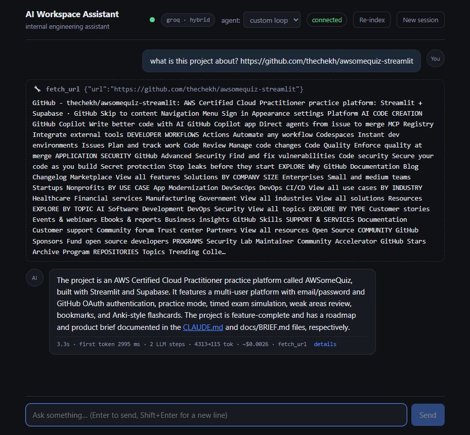
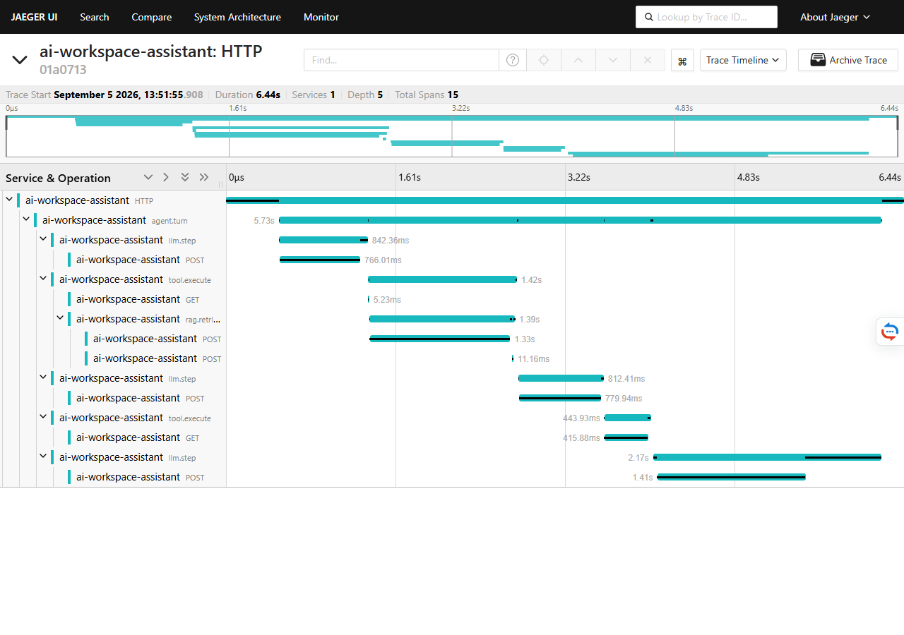
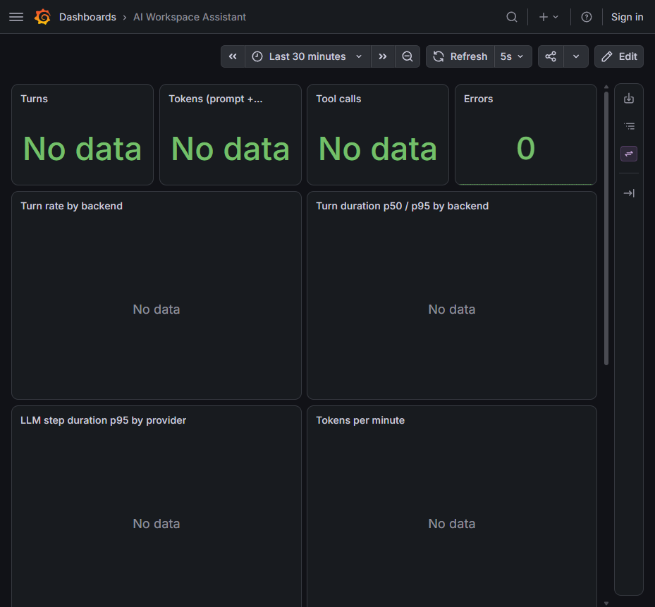

# Code walkthrough — one question, end to end

Read this with the repository open. It follows a single question —
**"How do we roll back a release?"** — through every layer of the system, in
execution order, naming the exact file and line at each step.

By the end you will have touched: the app factory, the WebSocket protocol,
rate limiting, cancellation, conversation memory, the agent loop, the LLM
client and its provider hardening, the tool seam, the whole RAG pipeline,
telemetry, persistence and the audit trail. That is the entire system.

Each step ends with **"If asked"** — the question a reviewer is most likely to
put to you at that exact point, and the answer.

> Line numbers are accurate as of the commit that introduced this page.
> If one has drifted, the symbol name in the heading still finds it.

---

## The 10-minute version

If you only have ten minutes before you present, read these six:

1. [`api/ws.py` → `_handle_turn`](../../src/assistant/api/ws.py#L173) — the conductor
2. [`agent/backends/custom.py` → `CustomAgent.run`](../../src/assistant/agent/backends/custom.py#L53) — the agent loop, 45 lines
3. [`agent/tools/base.py` → `Tool.run`](../../src/assistant/agent/tools/base.py#L34) — the one seam every tool call passes through
4. [`rag/retriever.py` → `search`](../../src/assistant/rag/retriever.py#L43) — retrieve → rerank → gate
5. [`llm/client.py` → `stream_step`](../../src/assistant/llm/client.py#L334) — the provider hardening
6. [`telemetry.py` → `InstrumentedLLM`](../../src/assistant/telemetry.py#L80) — how every number gets measured

---

## Step 0 — The app boots

**[`main.py` → `create_app`](../../src/assistant/main.py#L162)** and
**[`build_runtime`](../../src/assistant/main.py#L86)**

`create_app` is a factory, not a module-level app. Everything a request needs
is assembled once in `build_runtime` into a
[`Runtime` dataclass](../../src/assistant/main.py#L53) — Redis, the LLM client,
the session store, memory, the three agent backends, the HTTP client, Qdrant,
the MCP registry — and released in order by `Runtime.aclose`.

Two deliberate details:

- **The keyword overrides** (`redis_client=`, `llm=`, `retriever=`) exist so
  tests substitute whole collaborators — fakeredis, `FakeLLM`, in-memory
  Qdrant — without the factory growing `if x is None` branches.
- **[`__getattr__`](../../src/assistant/main.py#L230)** builds the app lazily.
  uvicorn resolves `assistant.main:app` with `getattr`, so the documented run
  command is unchanged, but *importing* the module no longer reads a
  developer's `.env`, reconfigures global logging, or installs an OTLP tracer.
  That was a real bug: the test suite was picking up local `.env` files.

**If asked — "why a factory instead of a module-level `app`?"**
Because a module-level app runs its side effects at import time, and the test
suite imports the module. Lazy construction is what lets 344 tests run with no
`.env`, no network and no containers.

---

## Step 1 — A browser connects

**[`api/ws.py` → `chat_endpoint`](../../src/assistant/api/ws.py#L39)**

The connection is accepted, then optionally authenticated: browsers cannot set
WebSocket headers, so the token arrives as `?token=`. It is compared with
`secrets.compare_digest`, not `==` — a plain comparison returns on the first
differing byte and leaks the secret to a timing attack.

`?backend=` picks the runtime for this connection (unknown values fall back to
the default), and `?session_id=` resumes an existing conversation. The server
replies with one `session` frame carrying the id.

**If asked — "why is the token in the URL? Isn't that leaky?"**
It is, and it is a known trade-off: query strings land in access logs. The
browser WebSocket API cannot set headers, so the alternatives are a
cookie or a short-lived ticket endpoint. For a single-tenant internal tool
behind a gateway this is acceptable; [security.md](security.md) lists it.

---

## Step 2 — The message arrives, and the loop stays free

**[`chat_endpoint`'s receive loop](../../src/assistant/api/ws.py#L79)**

```
raw = await websocket.receive_text()
incoming = TypeAdapter(ClientMessage).validate_json(raw)
```

`ClientMessage` is a discriminated union of `UserMessage | CancelRequest`
([schemas.py](../../src/assistant/api/schemas.py)). Invalid JSON produces an
`error` frame and the socket survives.

The critical structural decision is a few lines down: the turn is started as
an **`asyncio.Task`**, not awaited inline. A loop that awaits the answer cannot
read the next frame, and reading the next frame is the only way a `cancel` can
arrive mid-stream. A [done-callback](../../src/assistant/api/ws.py#L163)
retrieves the task's exception so a failure cannot vanish into asyncio's
"Task exception was never retrieved" at GC time.

**If asked — "why WebSockets and not SSE?"**
This step is the answer. SSE is one-way; stopping a turn would mean dropping
the connection. The `cancel` frame needs a channel back to the server, which
is exactly what a WebSocket provides.

---

## Step 3 — The budget guard

**[`_within_rate_limit`](../../src/assistant/api/ws.py#L142)** →
**[`RateLimiter.check`](../../src/assistant/api/rate_limit.py#L49)**

Checked *before* the turn starts, so a runaway client costs one Redis round
trip instead of an LLM call. A **sliding-window log** in a sorted set, not
`INCR`+`EXPIRE`: a fixed window lets a burst across the boundary through at
twice the limit. Refused requests are removed from the log again, so being
throttled never pushes your own reset further away.

**If asked — "is that your rate limiting or the provider's?"**
Both exist and they are different. This one is *yours*, protecting your budget
against a stuck client. The provider's 429 is handled separately in
[step 7](#step-7--the-llm-call-and-the-hardening-around-it).

---

## Step 4 — The conductor

**[`_handle_turn`](../../src/assistant/api/ws.py#L173)**

Owns the socket, the `agent.turn` span, error mapping and persistence. The
*accounting* deliberately lives elsewhere, in
[`TurnRecorder`](../../src/assistant/api/turn_recorder.py#L30) — feed it each
event with [`observe`](../../src/assistant/api/turn_recorder.py#L55), then ask
for a [`summary`](../../src/assistant/api/turn_recorder.py#L97) (the wire
frame) and a [`record`](../../src/assistant/api/turn_recorder.py#L119) (the
audit row). It touches neither socket nor Redis, so first-token latency, token
totals and cost are unit-testable without a live WebSocket.

A turn ends exactly one of three ways, and **all three send a `turn` frame**:
completed, `cancelled`, or `failed`. That makes the frame a usable end-of-turn
marker, and it keeps spend visible when a provider fails after retries —
returning early there once hid the cost of three prompts.

---

## Step 5 — Building the prompt

**[`ConversationMemory.context_for`](../../src/assistant/memory/conversation.py#L35)**

The full transcript lives in Redis untouched. What the *model* sees is bounded:

```
system prompt + [rolling summary] + last N verbatim messages + new question
```

When the un-summarized tail exceeds `history_char_budget`, everything but the
last `history_keep_recent` messages is folded into a persisted summary. Each
message is therefore summarized **at most once** — the work is incremental, not
repeated per turn.

The user message is appended to
[`SessionStore`](../../src/assistant/memory/session.py#L48) *before* the agent
runs, in the same pipeline that updates the recency index used by the Chats
panel.

**If asked — "what stops the prompt growing forever?"**
This function, and there is a test that proves it: after enough turns the
prompt size stops growing, identically on all three backends.

---

## Step 6 — The agent loop

**[`CustomAgent.run`](../../src/assistant/agent/backends/custom.py#L53)**

45 lines, no framework, and it is worth reading in full because it *is* the
ReAct pattern:

1. Stream an LLM step.
2. Text deltas become `TokenEvent`s, forwarded to the browser immediately.
3. If the model requested no tools → `FinalEvent`, done.
4. Otherwise execute each tool, append the results as `role="tool"` messages,
   and loop.
5. Bounded by `max_iterations` (6); exhausting it returns an honest message
   rather than looping forever.

**If asked — "why write the loop yourself when frameworks exist?"**
Because this is the mechanism the frameworks wrap, and 45 readable lines that
you can debug beat a black box for a system you have to defend. Both frameworks
are *also* implemented here, against the same
[`AgentBackend` protocol](../../src/assistant/agent/base.py#L68) — see
[backend-comparison.md](backend-comparison.md).

---

## Step 7 — The LLM call, and the hardening around it

**[`InstrumentedLLM.stream_step`](../../src/assistant/telemetry.py#L80)**
wraps **[`OpenAICompatibleLLM.stream_step`](../../src/assistant/llm/client.py#L334)**

Every provider here speaks the OpenAI-compatible API, so one client covers
openai/ollama/gemini and the provider is a config value.

The wrapper is the single telemetry seam: one span and one set of metrics per
LLM step, real token usage when the provider reports it and a `chars/4`
estimate when it does not. Its `finally` block records cost and latency even
when the turn is abandoned mid-stream.

Inside the client, three pieces of hardening that all came from real failures:

- **[`_create_stream`](../../src/assistant/llm/client.py#L404)** — 429 backoff
  honouring `Retry-After`, and a retry without `stream_options` for providers
  that reject it. `retry-after: 0` is valid and means "retry now", so it is
  tested against `None`, never truthiness.
- **`tool_use_failed` retry + salvage** — llama models periodically emit
  malformed tool-call JSON and OpenAI aborts the stream. Retried twice, then the
  model's attempt is recovered from `failed_generation`.
- **[`_LeakedTextBuffer`](../../src/assistant/llm/client.py#L227)** — llama
  sometimes prints a tool call as prose (`<function=name>{...}`). Leading text
  is withheld only while it could still be that markup, then flushed;
  [`parse_leaked_tool_calls`](../../src/assistant/llm/client.py#L132) recovers
  all four opener variants seen in the wild.

**If asked — "what breaks with real models that didn't with fakes?"**
Exactly these three, and that is the honest answer: the fake provider never
rate-limits or emits broken JSON, so the failures the hardening exists for are
the ones a fake cannot test. It is also why the pydantic-ai backend — which
bypasses this client entirely — had to re-implement the retries.

---

## Step 8 — The tool call

**[`ToolRegistry.execute`](../../src/assistant/agent/tools/base.py#L93)** →
**[`Tool.run`](../../src/assistant/agent/tools/base.py#L34)**

Every tool call from every backend, native or MCP, funnels through `Tool.run`.
That single seam owns:

- the **duplicate-call guard** — the same call twice in one turn returns a
  pointer to the first result instead of re-executing;
- the span, the metrics and the structured log;
- **crash isolation** — an exception becomes an `error:` *result* string, so a
  broken tool never ends the turn.

An unknown tool name is refused, and counted under a fixed `<unregistered>`
metric label — the name came from the model, and a hallucinated one would
otherwise add a Prometheus time series that never goes away.

**If asked — "how do you stop the model doing something dangerous?"**
This function. Names are allowlisted, arguments are schema-shaped, execution is
server-side, every tool is read-only, and nothing is `eval`'d.

---

## Step 9 — Retrieval

**[`make_search_docs`](../../src/assistant/agent/tools/search_docs.py#L31)** →
**[`Retriever.search`](../../src/assistant/rag/retriever.py#L43)**

The pipeline, in order:

1. **Embed the query** —
   [`HashEmbedder`](../../src/assistant/rag/embeddings.py#L32) by default:
   signed feature hashing into 512 dims, L2-normalized, deterministic and free.
   [`build_embedder`](../../src/assistant/rag/embeddings.py#L98) swaps in
   OpenAI or Voyage from config.
2. **Sparse-encode it** ([`sparse.py`](../../src/assistant/rag/sparse.py)) for
   the keyword channel.
3. **Query Qdrant** —
   [`VectorStore.search`](../../src/assistant/rag/store.py#L128) issues both as
   prefetches and fuses them server-side with **RRF**.
4. **Rerank** —
   [`LexicalReranker`](../../src/assistant/rag/rerank.py#L51) reorders the top
   candidates. This is the stage that measurably earns its place: +0.11
   recall@1.
5. **Gate** — chunks sharing no meaningful token with the query are dropped
   via [`query_overlap`](../../src/assistant/rag/rerank.py#L22), so "nothing
   relevant" is trustworthy rather than confident-looking noise.

What is *in* the index got there through
[`chunk_markdown`](../../src/assistant/rag/chunking.py#L73) — heading-aware,
with the heading breadcrumb prefixed to the embedded text — and
[`ingest_chunks`](../../src/assistant/rag/ingest.py#L38), which deletes a
source before re-adding it. Deterministic ids alone were not enough: shortening
a document left orphaned chunks that stayed searchable.

**If asked — "how do you know retrieval is any good?"**
It is measured, gated in CI, and the numbers are in
[metrics.md](metrics.md): recall@1 0.83, recall@5 1.00, MRR 0.92 on the
18-question golden set — 0.94 with a real embedder.

---

## Step 10 — Second step, final answer

The tool result goes back as a `role="tool"` message and the loop runs again.
This time the model answers in text, the loop yields `FinalEvent`, and
`_handle_turn` appends the answer to the session history.

---

## Step 11 — What the browser received

In order: `session` → `token`… → `tool_call` → `tool_result` → `token`… →
`final` → `turn`. Typed in
[`schemas.py`](../../src/assistant/api/schemas.py) and mirrored in
[`frontend/src/types.ts`](../../frontend/src/types.ts), so the protocol and the
agent contract cannot drift apart.

The Pinia store ([`stores/chat.ts`](../../frontend/src/stores/chat.ts)) reduces
those frames into the transcript. Dev mode reveals the tool cards and the stats
line; standard mode hides them — presentationally only, so switching reveals
the numbers for messages already on screen.



---

## Step 12 — Accounting and persistence

`summary()` produces the `turn` frame; `record()` adds the event timeline and
is stored by
[`append_turn`](../../src/assistant/memory/session.py#L120), capped at 50 turns
per session. `GET /api/sessions/{id}/turns/{turn_id}` serves it back — that is
what the **details** panel renders.

Cancelled and failed turns are excluded from the latency histogram (a provider
timeout is not your system's latency) but never from cost.

---

## Threaded through: observability

Four manual spans wrap the four seams —
`agent.turn` → `llm.step` → `tool.execute` → `rag.retrieve` — installed by
[`configure_observability`](../../src/assistant/observability.py#L30), which is
**fully inert** until a destination is configured. That is why instrumented
code needs no guards: the tracer is a no-op by default.



Metrics are always on (negligible cost) and scraped from `/metrics`:



Full detail in [handbook chapter 07](../handbook/07-observability.md).

---

## The other two backends

Same [`AgentBackend`](../../src/assistant/agent/base.py#L68) protocol, same
[`ToolRegistry`](../../src/assistant/agent/tools/base.py#L78):

- [`backends/pydantic_ai.py`](../../src/assistant/agent/backends/pydantic_ai.py)
  — drives pydantic-ai's graph iteration. It replaces the *model layer*, so it
  never reaches `llm/client.py` and had to re-implement the provider retries.
- [`backends/langgraph.py`](../../src/assistant/agent/backends/langgraph.py)
  — a StateGraph over an adapter to LangChain's message types.

Measured comparison: [backend-comparison.md](backend-comparison.md).

---

## Where the proof lives

| Claim | Test |
|---|---|
| The protocol works on all three backends | `tests/test_ws.py` (×3 parametrized) |
| The backends agree offline | `tests/test_fake_parity.py` |
| Provider errors map to useful text | `tests/test_llm_errors.py` |
| Retrieval quality | `evals/run_retrieval.py --memory --check`, gated in CI |
| Groundedness | `evals/run_ragas.py` — on demand, never in CI |
| The docs are true | `tests/test_docs_{links,consistency,coverage}.py` |
| The bugs a review found stay fixed | `tests/test_review_regressions.py` |

```sh
uv run pytest -q                 # 300+ tests, offline, no keys
uv run pytest -q -n 4            # the same, in parallel
```

Start with [`tests/test_ws.py`](../../tests/test_ws.py) — the whole protocol in
one screen — then walk `custom.py`, then run the suite ×3 backends.
