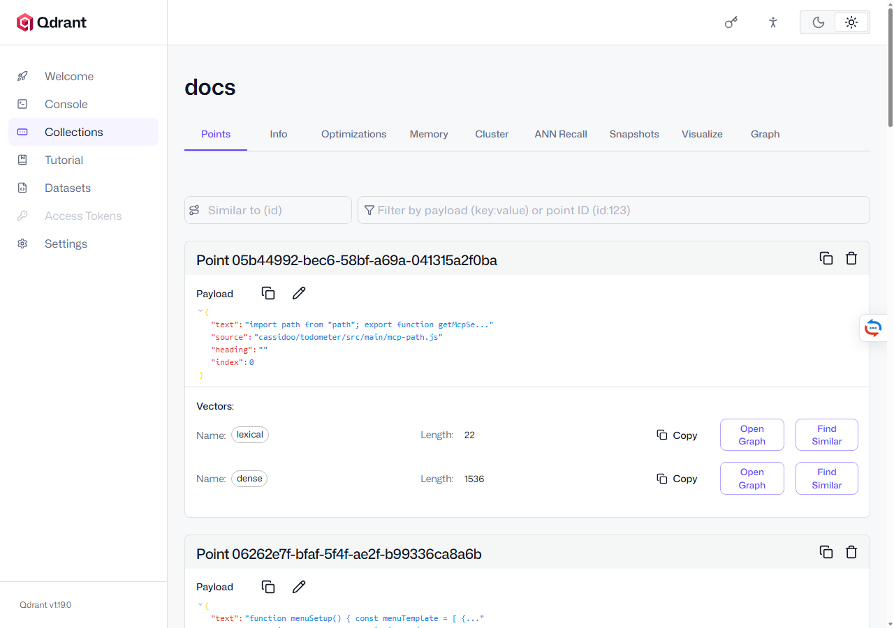
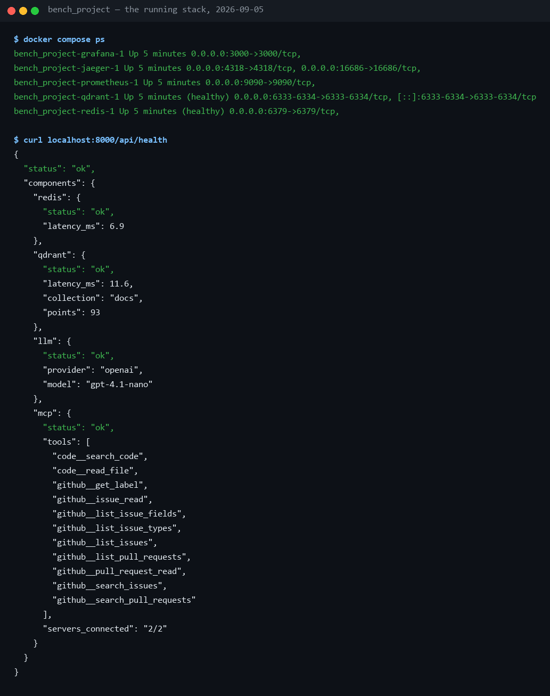

# Every localhost link — the running system, one page

**Everything reachable in a browser or a terminal once the stack is up —
the app, the dashboards, the vector database, the logs, the ports without a
UI — what each one shows, and how to prove the stack is healthy in one
command.** Start commands and every `.env` variable are in
[handbook/02](../handbook/02-getting-started.md); the demo-day sequence is in
[demo-runbook.md](../project/demo-runbook.md). Captured from the running
stack on 2026-09-05.

## 1. What is reachable

### The app — http://localhost:8000

| URL | What it is |
|---|---|
| http://localhost:8000/ | **Chat UI** — streaming chat, tool cards, per-turn stats and cost, the *details* audit timeline, the Documents panel, the backend dropdown, Stop |
| http://localhost:8000/docs | **Swagger / OpenAPI** — every REST endpoint, callable from the browser |
| http://localhost:8000/api/health | **Deep health** — Redis and Qdrant ping with latency, LLM provider and model, connected MCP servers and their tools |
| http://localhost:8000/api/info | the platform's shape: backends, provider, retrieval mode, auth |
| http://localhost:8000/healthz | liveness probe, `{"status":"ok"}` |
| http://localhost:8000/metrics | **Prometheus metrics** — every `assistant_*` counter and histogram, live |
| http://localhost:8000/api/documents | the knowledge base: `GET` lists sources, `POST` uploads, `DELETE /{source}` removes one |
| http://localhost:8000/api/sessions | recent conversations, the sidebar's data |
| http://localhost:8000/api/sessions/{id}/turns | **audit trail** — per-turn stats and the full event timeline, replayable |
| http://localhost:8000/dev | a minimal raw-WebSocket console, debug mode only |

The WebSocket endpoint, not a browser link: `ws://localhost:8000/chat`, with
`?backend=custom|pydantic_ai|langgraph`, `?session_id=…` to resume, and
`?token=…` when auth is on.

### Observability

| URL | What it is | How to use it |
|---|---|---|
| http://localhost:16686 | **Jaeger** — traces | service `ai-workspace-assistant` → Find Traces → open a turn: `agent.turn → llm.step → tool.execute → rag.retrieve` with timings, and with Logfire on, the httpx calls beneath them |
| http://localhost:3000 | **Grafana** — the dashboard | no login (anonymous admin) → *AI Workspace Assistant*: turns, p50/p95 by backend, tool calls by status, tokens per minute, errors by kind |
| http://localhost:9090 | **Prometheus** — raw queries | `assistant_cost_usd_total`, `assistant_tool_calls_total`, `histogram_quantile(0.95, rate(assistant_turn_seconds_bucket[5m]))`; `/targets` shows scrape status |

### The vector database — http://localhost:6333/dashboard

Qdrant's built-in UI. **Collections → `docs`** shows the schema itself: two
named vectors per point, `dense` (1,536 dimensions in the real profile, 512
in dev) and `lexical` (sparse) — the hybrid-search design, visible. Open the
collection to browse points: every chunk with its `source`
(`owner/repo/path` for ingested repositories), its `heading` breadcrumb and
its `text`. The **Console** tab runs raw calls, for example
`POST collections/docs/points/scroll` with `{"limit": 10, "with_payload": true}`.



Line by line:

- **`docs` → Points** — one card per stored chunk; the tabs (Info,
  Optimizations, Memory, Snapshots, Visualize, Graph) are Qdrant's own.
- **Payload** — `text` (the chunk, here the start of `mcp-path.js`),
  `source` (`cassidoo/todometer/src/main/mcp-path.js` — the
  `owner/repo/path` naming that keeps two repositories' files apart),
  `heading` (empty for a code file; a breadcrumb for Markdown) and `index`.
- **Vectors: `lexical`, length 22** — the sparse vector: 22 non-zero
  token positions for this short chunk.
- **Vectors: `dense`, length 1536** — the real-profile embedding
  (`text-embedding-3-small`); with the offline hash embedder this reads 512.

### Logs

| What | Where |
|---|---|
| the app log — every turn, tool call and retrieval, correlated by `session_id` and `turn_id` | the uvicorn terminal, or the file it was redirected to; JSON lines with `ASSISTANT_LOG_JSON=true` |
| the per-turn audit, the friendliest view | *details* under any answer; the same data at `/api/sessions/{id}/turns` |
| container logs | `docker logs -f bench_project-qdrant-1`, likewise `-redis-1`, `-jaeger-1`, `-prometheus-1`, `-grafana-1` |
| full prompt and completion dumps, dev only | `ASSISTANT_LOG_PROMPTS=true` — conversations end up in the log |

### Ports without a UI

| Port | What |
|---|---|
| 6379 | Redis — `docker exec -it bench_project-redis-1 redis-cli`, then `KEYS session:*`, `TTL …` |
| 6334 | Qdrant gRPC |
| 4318 | Jaeger's OTLP ingest, where the app sends spans (`ASSISTANT_OTLP_ENDPOINT`) |
| 5173 | the Vite dev server, only during `npm run dev` (hot reload, proxies to :8000) |

### Not on localhost: the cloud dashboards

| Tool | Dashboard | Enabled by |
|---|---|---|
| Logfire | https://logfire-eu.pydantic.dev (EU token) or https://logfire-us.pydantic.dev (US token) | `ASSISTANT_LOGFIRE_TOKEN` |
| Langfuse | https://cloud.langfuse.com (EU) or https://us.cloud.langfuse.com (US) | `ASSISTANT_LANGFUSE_PUBLIC_KEY` + `ASSISTANT_LANGFUSE_SECRET_KEY` |

The startup log line `tracing configured (otlp=…, logfire=…, langfuse=…)`
says which destinations are live; [logfire-langfuse.md](logfire-langfuse.md)
walks both.

## 2. How the pieces connect

Five containers and one process. Redis holds sessions, history, the audit
trail and the rate-limit windows; Qdrant holds the knowledge base; the app
process serves the UI, the API and the WebSocket on :8000 and pushes spans to
Jaeger on :4318; Prometheus scrapes :8000/metrics every 5 s; Grafana reads
Prometheus. Nothing else talks to anything: the app is the only client of
Redis and Qdrant, and the dashboards only read.

## 3. Where it lives in this project

| File | What it serves |
|---|---|
| [docker-compose.yml](../../docker-compose.yml) | Redis and Qdrant by default; Jaeger, Prometheus, Grafana under `--profile observability`; the app itself under `--profile app` |
| [main.py](../../src/assistant/main.py) | mounts the UI from `frontend/dist`, `/metrics`, `/healthz`, and the API router |
| [api/routes.py](../../src/assistant/api/routes.py) | `/api/health`, `/api/info`, documents, sessions, the audit trail |
| [api/ws.py](../../src/assistant/api/ws.py) | `ws://…/chat` |
| [observability/](../../observability/) | Prometheus scrape config and the provisioned Grafana dashboard |
| [.env.production.example](../../.env.production.example) | the real profile: which of the links above are live with which settings |

## 4. How to run it

```sh
docker compose up -d redis qdrant                 # the infrastructure
docker compose --profile observability up -d      # + Jaeger, Prometheus, Grafana
uv run uvicorn assistant.main:app                 # the app on :8000

# one-command proof that everything is up
curl localhost:8000/api/health
```

| Step | Wall clock |
|---|---|
| `docker compose up -d` from a warm image cache | ~10 s until Redis and Qdrant report healthy |
| the app | ~3 s to the first health `ok` |
| Docker Desktop cold start on this machine | ~60 s, and it has to be running first |

## 5. How to see it



Line by line:

- **`docker compose ps`** — five containers `Up`, Redis and Qdrant
  `(healthy)`; the ports column is the map in §1.
- **`"status": "ok"`** — every component answered. Degraded means one did
  not, and names it.
- **`"redis": … "latency_ms"`** and **`"qdrant": … "points": 93`** — real
  round trips, and the knowledge base's size at capture time.
- **`"llm": {"provider": "openai", "model": "gpt-4.1-nano"}`** — the real
  profile; with the fake provider this reads `"fake"`.
- **`"mcp": … "servers_connected": "2/2"`** and the eleven tool names — the
  bundled `code` server and GitHub's hosted read-only server, both up. A
  `1/2` here is the first thing to check when a GitHub question fails.

## 6. Proving it

The health JSON is the proof, and it is deep on purpose: each component is
actually pinged and timed, not assumed from configuration. The UI's header
dot polls the same endpoint every 10 s, so an amber dot and this JSON always
agree. The tests in [test_observability.py](../../tests/test_observability.py)
pin both states — `ok` with every component, and `degraded` with the failing
one named — and [test_api_routes.py](../../tests/test_api_routes.py) pins
which of the routes above stay open when auth is on.

## 7. Showing it live

The strongest single demonstration: ask one question in the chat, then show
the same turn three ways — the *details* timeline in the UI, the trace in
Jaeger (search by the turn id from the stats-line tooltip), and the cost
tick in Grafana. *"One question, three lenses, one story."* About a minute.

## 8. Reading it honestly

- **Docker Desktop dies on this machine.** Repeatedly, during this project.
  The first check when anything is amber is `docker info`; the cure is to
  start Docker Desktop, `docker compose up -d`, and restart the app.
- **The dashboards are anonymous.** Grafana is anonymous-admin and Prometheus
  is open; both are local-compose conveniences and would need auth before any
  deployment ([security.md §8](security.md)).
- **`/metrics` is open by design**, and it exposes token counts and spend.
- **Prometheus scrapes the host-run app**; the compose-run `api` target may
  show down when the app runs from `uv run`, which is expected.
- **Two of the links are not localhost at all** — the cloud lenses — and
  they receive prompt content when the Pydantic AI backend is selected.

## 9. Troubleshooting

| Symptom | Cause | Fix |
|---|---|---|
| `curl localhost:8000/api/health` → `"redis": {"status": "error", "detail": "…"}` | Docker Desktop is not running, or the containers are down | `docker info`; start Docker Desktop; `docker compose up -d` |
| `"qdrant": {"status": "error", "detail": "All connection attempts failed"}` | no Qdrant — normal in Tier A of the checklist | `docker compose up -d qdrant`, or accept degraded mode offline |
| `"mcp": … "servers_connected": "1/2"` | one MCP server failed to connect within 15 s | the startup log names it; for the hosted GitHub server check the PAT |
| http://localhost:8000/ shows a control the docs do not mention | a stale `frontend/dist` | `cd frontend && npm run build`, restart the app |
| `error while attempting to bind on address ('127.0.0.1', 8000)` | an older app process still holds the port | `netstat -ano \| findstr :8000`, then `taskkill /PID <pid> /F` |
| Jaeger shows the service but no traces | `ASSISTANT_OTLP_ENDPOINT` unset, or set after the app started | set it, restart the app |
| Prometheus `/targets` shows `assistant` down | the app is not on :8000 from the container's point of view | run the app on the host; the scrape config expects `host.docker.internal:8000` |

## 10. Related

- [handbook/07 — Observability](../handbook/07-observability.md) — what each dashboard shows, and the one-message drill through all of them
- [handbook/02 — Getting started](../handbook/02-getting-started.md) — the four run modes and every `.env` variable behind these links
- [logfire-langfuse.md](logfire-langfuse.md) — the two dashboards that are not on localhost
- [project/demo-runbook.md](../project/demo-runbook.md) — the order to open these in on demo day
- [testing.md](testing.md) — the checklist that walks these links tier by tier
