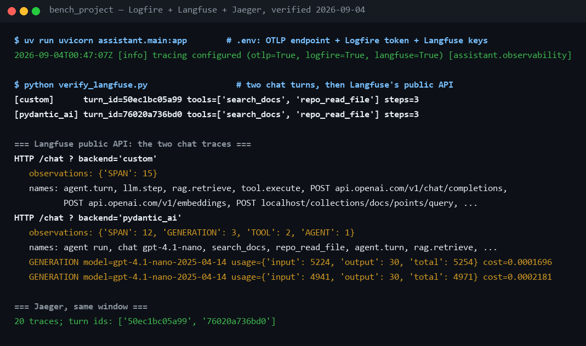

# Logfire and Langfuse — the two cloud lenses

**What each tool is for, how they differ, how they are wired here, how to
switch them on, and what you will see in each dashboard for this app —
verified on real turns, both backends.** Jaeger, the local lens, is covered
in [handbook/07](../handbook/07-observability.md); this page is about the two
cloud ones and how they relate.

## 1. Purpose — why two, and why both

One turn of this assistant is several things at once: an HTTP/WebSocket
request with Redis and Qdrant calls behind it, and an LLM conversation with
prompts, tool calls, tokens and a price. The two tools look at that same turn
from those two sides.

- **Logfire** (from the Pydantic team) is the **application view**: request
  latency, the WebSocket lifecycle, every outgoing HTTP call, exceptions —
  classic APM, built on OpenTelemetry, with SQL over the spans. Its
  Pydantic AI instrumentation is a one-liner, which is why it earned a place
  next to that backend.
- **Langfuse** (open source, cloud or self-hosted) is the **LLM view**:
  *generations* with model, token usage and computed cost, *sessions* that
  group a conversation, versioned *prompts*, and *scores* that attach an
  evaluation result to the trace it judged.

They are not competitors here. Both are OpenTelemetry-based, so the app
emits its spans **once** and each tool receives the same stream; the code in
[observability.py](../../src/assistant/observability.py) is one pipeline with
up to three destinations (Jaeger, Logfire, Langfuse), any combination.

## 2. Comparison

| | Logfire | Langfuse |
|---|---|---|
| Who makes it | the Pydantic team | independent open-source project |
| Focus | application performance: latency, exceptions, DB and HTTP calls | LLM operations: generations, sessions, token cost per model |
| Data model | OpenTelemetry spans, queried with SQL | traces plus LLM objects: generations, prompts, scores, datasets |
| Unique strengths | one-line FastAPI / httpx / Pydantic AI instrumentation; SQL explorer; live view | prompt versioning; scores on traces; cost dashboards; sessions view |
| Hosting | cloud, EU or US region | cloud (EU or US) or self-hosted with Docker |
| How this app feeds it | Logfire SDK becomes the tracer provider and auto-instruments | plain OTLP export to its endpoint, authenticated with the project keys; no SDK |
| What it needs in `.env` | `ASSISTANT_LOGFIRE_TOKEN` | `ASSISTANT_LANGFUSE_PUBLIC_KEY`, `ASSISTANT_LANGFUSE_SECRET_KEY` (+ `_HOST` for the US region) |
| Dashboard | https://logfire-eu.pydantic.dev or https://logfire-us.pydantic.dev, by token region | https://cloud.langfuse.com or https://us.cloud.langfuse.com |
| Best question to ask it | "why was this turn slow, and where did it fail?" | "what did the model see, what did it cost, how did quality change?" |

**Which is better** depends on the question. Latency and failures: Logfire.
Prompts, cost and quality over time: Langfuse. For the workshop, Jaeger is
the live demo because it needs no account; Logfire is the one to enable
first (already a dependency, five minutes); Langfuse earns its place the
moment someone asks about prompt management or attaching the Ragas score
([reference/ragas.md](ragas.md)) to real traces.

## 3. How they are wired here

Everything lives in one function, `configure_observability`, called once at
startup:

1. Nothing is imported and no global tracing state exists until a
   destination is configured — tests and a no-`.env` checkout stay inert.
2. An OTLP exporter is built for Jaeger if `ASSISTANT_OTLP_ENDPOINT` is set,
   and another for Langfuse if both Langfuse keys are set (basic auth
   `public:secret` to `<host>/api/public/otel/v1/traces`).
3. If a Logfire token is set, **Logfire's SDK becomes the tracer provider**
   and the other exporters are attached to it; it then instruments FastAPI,
   httpx and Pydantic AI. Without Logfire, a plain OpenTelemetry provider
   feeds the exporters and only the app's own four spans exist
   (`agent.turn`, `llm.step`, `tool.execute`, `rag.retrieve`).
4. The startup log states the result, and it is the first thing to check:
   ```
   tracing configured (otlp=True, logfire=True, langfuse=True)
   ```

**Noise control, learned the hard way.** Prometheus scrapes `/metrics` every
5 s and the UI polls `/api/health` every 10 s. Instrumented, those alone were
1,000+ traces an hour in both cloud dashboards, burying the real turns and
spending quota: the first check found 14 of the latest 50 Langfuse traces
were scrapes. Two measures, both pinned by tests in
[test_observability.py](../../tests/test_observability.py):

- those paths are excluded from FastAPI instrumentation (`NOISY_PATHS`);
- a head **sampler** drops any *root* span that is machinery — the same
  paths, plus any root HTTP **client** call to local infrastructure such as
  the health check's own Qdrant count, which became an orphan root once its
  request span was excluded. Two details were learned by getting them wrong:
  httpx spans are born under a bare method name (`POST`) and renamed only
  after the sampling decision, so the sampler reads the *attributes*
  (`server.address`, `http.url`); and it must judge **client** spans only,
  because the WebSocket *server* span for `/chat` also carries
  `server.address = 127.0.0.1` — one version dropped every real turn of the
  locally served app before the check found it. Children always follow
  their parent, so a real turn is never fragmented.

After the fix, thirty seconds of scrapes and health polls produced **zero**
traces in Langfuse; the two chat turns sent in the same window arrived
intact.

## 4. How to run them

Add the credentials to `.env` — never to a commit or a chat — and restart
the gateway, because `.env` is read at startup.

```sh
# Logfire: Project settings → Write tokens. The prefix says the region:
# pylf_v1_eu_… lives at logfire-eu.pydantic.dev, pylf_v1_us_… at logfire-us.
ASSISTANT_LOGFIRE_TOKEN=pylf_v1_eu_...

# Langfuse: Project settings → API Keys → Create.
ASSISTANT_LANGFUSE_PUBLIC_KEY=pk-lf-...
ASSISTANT_LANGFUSE_SECRET_KEY=sk-lf-...
ASSISTANT_LANGFUSE_HOST=https://cloud.langfuse.com   # or https://us.cloud.langfuse.com

# keep Jaeger too — all three receive the same spans
ASSISTANT_OTLP_ENDPOINT=http://localhost:4318
```

```sh
docker compose --profile observability up -d    # Jaeger, Prometheus, Grafana
uv run uvicorn assistant.main:app               # look for "tracing configured (…)"
```

Then send one message in the chat at http://localhost:8000/, wait a few
seconds (spans are exported in batches), and open the dashboards. Free tiers
of both cover a workshop many times over; a turn is a dozen spans.

## 5. What you see, dashboard by dashboard

The app's spans use its own attribute names (`llm.model`, `llm.tool_calls`,
`rag.top_score`, `tool.status`, `agent.backend`, `session.id`, `turn.id`).
Logfire's Pydantic AI instrumentation additionally emits spans in the
**GenAI semantic conventions**, and that difference decides what each
dashboard can show per backend. Verified on real turns:

| Backend | What arrives | Langfuse observation types | Token usage and cost in Langfuse |
|---|---|---|---|
| `custom` (and `langgraph`) | the app's four spans + the httpx calls under them | 15 × SPAN | no — counts live in the app's own stats line and Prometheus |
| `pydantic_ai` | the same, plus Pydantic AI's own spans | 12 × SPAN, 3 × GENERATION, 2 × TOOL, 1 × AGENT | **yes** — model `gpt-4.1-nano-2025-04-14`, input/output tokens per call, cost computed by Langfuse |

### Logfire

1. **Live** — the stream of spans as they arrive. One message in the chat
   is one tree: the WebSocket request at the root, `agent.turn` under it,
   then `llm.step` / `rag.retrieve` / `tool.execute`, and under each LLM
   step an httpx child that is the actual `POST …/chat/completions` with
   status and duration. Click any span for its attributes.
2. Switch the backend dropdown to **Pydantic AI** and send another message:
   the tree gains `agent run`, `chat gpt-4.1-nano` and per-tool spans with
   token counts — the framework's own instrumentation, one line to enable.
3. **Explore** — SQL over the spans. Every turn slower than two seconds:
   ```sql
   SELECT start_timestamp, duration, attributes->>'agent.backend' AS backend
   FROM records WHERE span_name = 'agent.turn' AND duration > 2
   ORDER BY start_timestamp DESC
   ```

### Langfuse

1. **Tracing → Traces** — one trace per turn, named after the WebSocket
   request (`HTTP /chat ? backend='custom'`). Open it for the observation
   tree; the trace attributes carry `session.id` and `turn.id`.
2. With the **Pydantic AI** backend, the LLM calls appear as
   **generations**: model, input/output tokens, and a cost that Langfuse
   computes from its price table — independently of the app's own estimate,
   which is a useful cross-check.
3. **Sessions** groups every turn of one conversation. **Prompts** is
   versioned prompt management (the system prompt could live there).
   **Scores** attaches an evaluation to a trace — where a Ragas faithfulness
   score for a judged answer belongs.

### The same turn in three places

Send one message, read its `turn.id` from the stats line's tooltip in the
chat, and find it in Jaeger (http://localhost:16686), in Logfire's Live
view, and in the Langfuse trace. Same id, same tree, three lenses.

## 6. What the verification found

Enabling both against the running app, on 2026-09-04:



Beyond the noise problem in §3, the cross-check exposed a real defect: for
the Pydantic AI backend the app's own stats line reported **0 prompt tokens**
and a cost of $0.000016, while Langfuse's generations showed ~5,000 input
tokens per call — the backend drives the provider through its own model
layer and never passed through `InstrumentedLLM`, so nothing counted its
tokens. It now reports the run's usage into the same stats and counters
(`record_external_usage` in [telemetry.py](../../src/assistant/telemetry.py)),
so the stats line, the cost metric and Langfuse agree, and the three backends
are comparable on cost as well as on behaviour. That is what a second,
independent measurement is for.

## 7. Privacy and cost, stated plainly

- **What leaves the machine.** With the custom or LangGraph backend, spans
  carry names, timings, counts and ids — not prompt or document text. With
  the Pydantic AI backend under Logfire's instrumentation, message content
  is recorded on the framework's spans by default, so prompts, retrieved
  chunks and answers reach both clouds. For a demo on internal documents,
  know which backend is selected before you press Enter.
- **Quota.** Spans are batched and exported every few seconds. A turn is a
  dozen or so; the scrape noise, before the fix, was the only thing that
  ever threatened a free tier.
- **Tokens.** The Logfire token and the Langfuse keys are write credentials
  for your projects. They sit in the gitignored `.env`; anything pasted into
  a chat or a ticket should be rotated afterwards.

## 8. Troubleshooting

| Symptom | Likely cause | Fix |
|---|---|---|
| Startup log says `logfire=False` / `langfuse=False` | variable missing from `.env`, or the server was not restarted | check the names in §4, restart |
| Logfire Live view stays empty, no errors in the log | the token is for another project or region, or is a read token | create a *write* token in the project you are looking at; match the dashboard to the token prefix |
| Langfuse shows nothing; log shows `401`/`403` on export | keys swapped, or wrong region host | public key is `pk-lf-`, secret is `sk-lf-`; set `ASSISTANT_LANGFUSE_HOST` for the US region |
| Traces arrive late | batched export | wait a few seconds, or stop the server — shutdown flushes |
| Dashboards fill with `GET /metrics` | running a build older than the noise fix | update; the exclusion and sampler are in `observability.py` |
| Jaeger stopped receiving | `ASSISTANT_OTLP_ENDPOINT` removed while editing `.env` | keep all three; they compose |

## 9. Related

- [handbook/07 — Observability](../handbook/07-observability.md) — every surface, and the one-message drill through all of them
- [reference/localhost.md](localhost.md) — the local links; the cloud dashboards are listed there for completeness
- [reference/ragas.md](ragas.md) — the judged metric that Langfuse's scores can carry
- [theory/09 — Observability & evals](../theory/09-observability-and-evals.md) — the concepts
