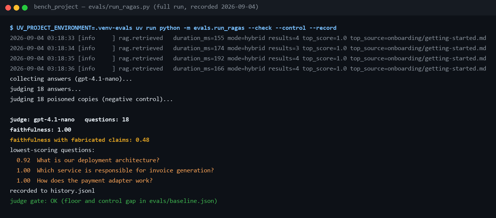
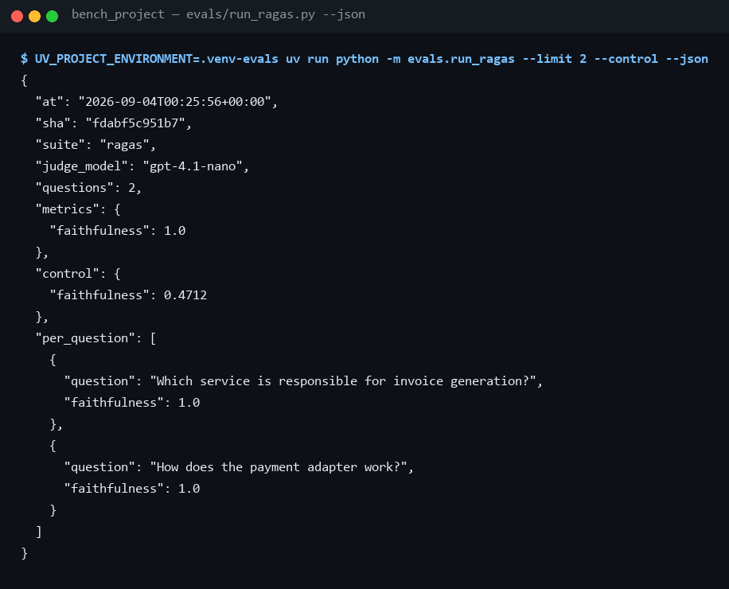
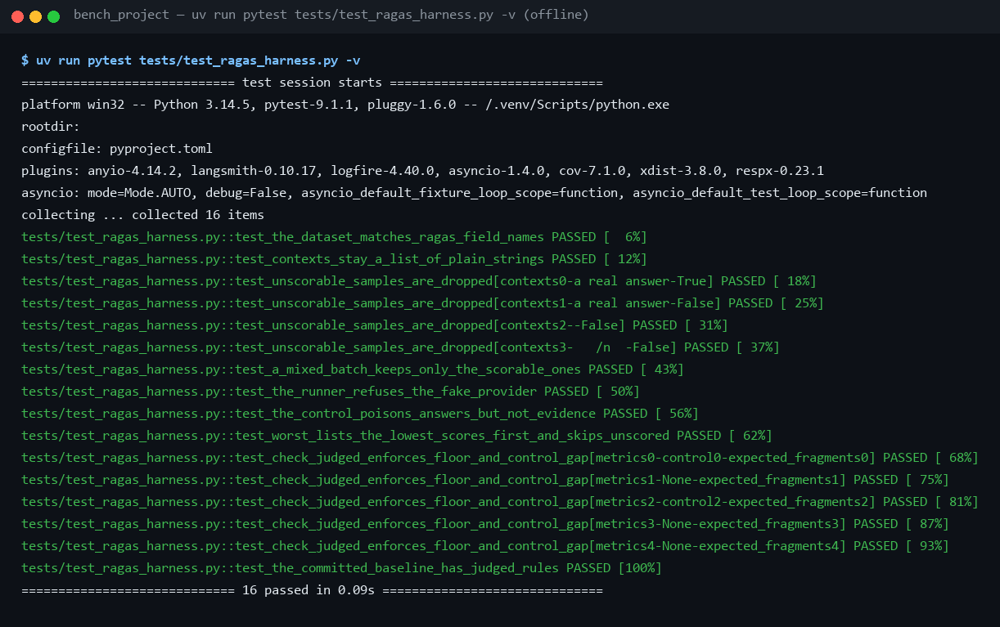

# Ragas — the LLM judge

**What Ragas is, what it measures in this project, how to run it, how to read
what it prints, and how to prove in front of a room that the number means
something.** For where this metric sits among the others, see
[metrics.md](metrics.md); this page is the judge itself, end to end.

## 1. What Ragas is

[Ragas](https://docs.ragas.io) (*Retrieval-Augmented Generation Assessment*)
is an open-source Python library that scores RAG systems with a language
model acting as the judge. You hand it, per question, what the user asked,
what the retriever returned, and what the model answered; it asks a judge
model structured questions about that triple and turns the answers into
numbers between 0 and 1.

That makes it the complement of this project's other eval.
[run_retrieval.py](../../evals/run_retrieval.py) answers *"did the right chunk
come back?"* — deterministic, free, and therefore a CI gate. It cannot see
what the model did next. A system can retrieve the perfect chunk and then
write something the chunk never said; only a judge that reads the answer
against the evidence can catch that.

The metrics Ragas offers, and what each needs:

| Metric | Question it answers | Needs | Used here |
|---|---|---|---|
| **Faithfulness** | Is every claim in the answer supported by the retrieved text? | judge LLM only | **yes** |
| ResponseRelevancy | Does the answer address the question? | judge LLM + embeddings | no |
| LLMContextPrecision (no reference) | Are the retrieved chunks relevant to the question? | judge LLM | no |
| LLMContextRecall | Did retrieval cover everything the reference answer needs? | judge LLM + reference answer | no |
| FactualCorrectness | Does the answer agree with the reference answer? | judge LLM + reference answer | no |
| AspectCritic | Free-form yes/no rubrics ("is it concise?") | judge LLM | no |

Only **Faithfulness** is enabled, for three reasons that reinforce each
other. It is *reference-free*: the golden set ([golden.yaml](../../evals/golden.yaml))
records *where* each answer lives, not the answer itself, which is all recall
and MRR need but not what the reference-based metrics want. It needs *no
embeddings*, so the judge runs against any OpenAI-compatible endpoint, even
one with no embeddings API. And it is the metric behind the question the
workshop will actually ask — *"how do you know it doesn't hallucinate?"* —
which the negative control in §6 can prove rather than assert.

## 2. How faithfulness is computed

Two judge calls per question:

1. **Decompose.** The judge splits the answer into atomic claims — short,
   self-contained statements.
2. **Verify.** For each claim, the judge decides whether the retrieved
   chunks support it (a natural-language-inference "yes / no" with a reason).

```
faithfulness = supported claims / all claims
```

A worked example from this project's own fixture corpus. The retrieved chunk
says *"billing-service generates PDF invoices on a nightly schedule."*

| Answer | Claims | Supported | Score |
|---|---|---|---:|
| "billing-service generates PDF invoices nightly." | 2 | 2 | **1.00** |
| "billing-service generates invoices every 5 minutes and is written in Rust." | 3 | 1 | **0.33** |

Two things about the scale are easy to get backwards:

- **Unsupported is not the same as false.** A true fact that is not in the
  retrieved text still counts against the answer. That is the intended
  strictness: this assistant's contract is to answer *from the knowledge
  base*, not from the model's memory.
- **"I could not find that" is perfectly faithful** — no claims, nothing to
  contradict. Scoring it would flatter the average, so the runner drops
  declined and empty answers before judging (`usable()` in
  [run_ragas.py](../../evals/run_ragas.py)). The number is about answers the
  model actually committed to.

## 3. Where it lives in this project

| Piece | Role |
|---|---|
| [evals/run_ragas.py](../../evals/run_ragas.py) | The runner: collects answers from the real agent, judges them, runs the control, gates, records |
| [evals/baseline.json](../../evals/baseline.json) → `judged` | The floor (0.80) and the control gap (0.20) that `--check` enforces |
| [evals/history.jsonl](../../evals/history.jsonl) | The trend log; rows with `"suite": "ragas"` are judged runs |
| [tests/test_ragas_harness.py](../../tests/test_ragas_harness.py) | Everything around the judge, tested offline — no Ragas, no LLM |
| [pyproject.toml](../../pyproject.toml) → `[dependency-groups] evals` | Ragas as an opt-in group, so the image and a plain `uv sync` never carry its ~35 packages |
| `.venv-evals/` (gitignored) | The judge's own Python 3.13 environment — see §4 |

What one run does, in order:

1. Ingests [evals/corpus/](../../evals/corpus/) into an **in-memory Qdrant**,
   exactly as the retrieval eval does — nothing touches the running gateway
   or its knowledge base.
2. For each golden question, runs the **real agent** (the custom backend with
   the real `search_docs` tool and the configured model) and keeps both the
   final answer and the four chunks the retriever returned. The judge scores
   against the chunks the model *actually saw*, not a second search after the
   fact.
3. Sends question + chunks + answer to Ragas **Faithfulness**, with the same
   configured model as the judge.
4. With `--control`, judges the same samples again with fabricated claims
   appended to every answer (§6).
5. Prints the mean, the control mean, and the lowest-scoring questions;
   with `--record` appends a row to the history; with `--check` exits 1 if
   the floor or the control gap is violated.

**Why it is never a CI gate.** Every score is a paid LLM call, so it fails
the project's first rule (a check that needs a key will not run); the scores
move between runs on identical input, so any tight threshold would flake; and
cents per push is exactly the spend a free offline gate exists to avoid. So
it is a *floor with headroom, checked on demand* — the full reasoning is in
[metrics.md](metrics.md#why-it-is-not-a-ci-gate).

## 4. How to run it

Ragas depends on `scikit-network`, which publishes wheels for Python 3.10–3.13
only. This machine develops on 3.14, so the judge gets an environment of its
own; `uv` builds it next to the main `.venv` and leaves that one untouched.

```sh
# once
UV_PROJECT_ENVIRONMENT=.venv-evals uv sync --python 3.13 --group evals

# a quick, cheap proof (about a minute)
UV_PROJECT_ENVIRONMENT=.venv-evals uv run python -m evals.run_ragas --limit 3 --control

# the full flow: floor check, negative control, appended to the trend log
UV_PROJECT_ENVIRONMENT=.venv-evals uv run python -m evals.run_ragas --check --control --record
```

PowerShell: set `$env:UV_PROJECT_ENVIRONMENT = ".venv-evals"` once per
shell, then run the same `uv run` commands without the prefix.

The runner reads the same `.env` as the gateway, so it uses the configured
provider and model. It refuses the `fake` provider on purpose — judging a
scripted echo would print a meaningless number — and points at the offline
retrieval eval instead.

| Flag | What it does |
|---|---|
| `--limit N` | Only the first N golden questions. Use it to price a new judge model before a full run. |
| `--control` | Judges every answer a second time with three fabricated claims appended. The score must fall (§6). |
| `--check` | Exit 1 if the clean mean is below `judged.faithfulness.floor`, or if the control fell by less than `control_gap`. |
| `--record` | Append the run — control included — to `evals/history.jsonl`. Recording happens *before* the gate, so a failing run stays in the trend. |
| `--json` | Machine-readable output, with per-question scores. |

| Run | Judge calls | Wall clock | Cost on `gpt-4.1-nano` |
|---|---|---|---|
| `--limit 3 --control` | ~35 | ~1 min | well under a cent |
| all 18, `--control` | ~400 | ~6 min | a few cents |

Faithfulness spends several judge calls per question (one to extract claims,
then verification), and the control doubles the judging. Start with
`--limit 3` on any model you have not priced.

## 5. How to see it

### The full recorded run



Line by line:

- **`collecting answers (gpt-4.1-nano)`** — the real agent answering all 18
  golden questions against the in-memory corpus. The `rag.retrieved` log
  lines above it are the retriever's own telemetry, one per search.
- **`judging 18 answers`** — Ragas scoring the clean answers.
- **`judging 18 poisoned copies (negative control)`** — the same answers
  with fabricated claims appended, scored again.
- **`faithfulness: 1.00`** — the mean over the clean answers (0.996
  unrounded, in the history row).
- **`faithfulness with fabricated claims: 0.48`** — the mean over the
  poisoned copies. This line is what makes the one above it credible.
- **`lowest-scoring questions`** — the three weakest, lowest first. Here
  one question sits at 0.92: one claim in the deployment-architecture answer
  that the judge could not tie to the retrieved chunks. That is the line a
  human should read next, which is why the runner prints it instead of only
  the mean.
- **`recorded to history.jsonl`** and **`judge gate: OK`** — the row was
  appended, then both rules in `baseline.json` passed.

### Per-question detail with `--json`



`--json` prints the same record that `--record` would append, plus a
`per_question` list. Pipe it to a file when you want to diff two judge
models, or to find which question moved after a prompt change.

### The trend log

Every recorded run is one line in [history.jsonl](../../evals/history.jsonl),
next to the retrieval runs:

```json
{"at": "2026-09-04T00:19:17+00:00", "sha": "41a3157e4337", "suite": "ragas",
 "judge_model": "gpt-4.1-nano", "questions": 18,
 "metrics": {"faithfulness": 0.9957}, "control": {"faithfulness": 0.4763}}
```

```sh
grep '"suite": "ragas"' evals/history.jsonl      # every judged run, oldest first
```

The commit SHA is in every row, so a drop can be traced to the change that
caused it — the same discipline as the retrieval trend.

### What is tested without a judge



The scoring itself needs a real model, so it lives outside the suite — but
everything around it is where the bugs would be, and that runs in the normal
366-test suite with no key and no Ragas installed: the dataset matches
Ragas' field contract exactly (`user_input` / `retrieved_contexts` /
`response`, asserted as literal strings so a rename fails here instead of
producing an empty score two hundred calls later), unanswerable questions are
dropped before judging, the control poisons answers but never the evidence,
the lowest-score list is ordered and skips unscored rows, and the gate rules
fire on exactly the conditions they should.

## 6. The negative control — proving the judge

A high score alone proves nothing. A judge that answers "supported" to
everything also scores 1.00, and so does an answer that only restates the
question. The judge is only proven when it can *fail* something.

`--control` takes every sample that was just scored and appends three claims
that no document in the corpus supports:

> *This component was rewritten in Rust in 2031 by the Frankfurt platform
> team. It listens on port 9999 and is scheduled for removal after the next
> audit.*

The questions and the retrieved chunks stay exactly the same — only the
answers change. If the judge works, it marks each of the three claims
unsupported, and a fully grounded answer with *k* claims lands at
*k / (k + 3)*. For answers as short as these that is about a half, and the
measured run agrees:

| | Faithfulness |
|---|---:|
| Clean answers | **1.00** |
| Same answers + three fabricated claims | **0.48** |
| Required drop (`control_gap`) | ≥ 0.20 |
| Required clean floor (`floor`) | ≥ 0.80 |

Both rules live in [baseline.json](../../evals/baseline.json) under `judged`,
with headroom below the measured values. When `--check` fails, the message
says which rule and by how much:

```
JUDGED QUALITY BELOW evals/baseline.json:
  faithfulness: fabricated claims lowered the score by only 0.05 (clean 0.95, poisoned 0.90);
  the baseline requires a drop of at least 0.20 — the judge is not catching invented claims
```

That failure would mean the *judge* is broken — a lenient model, a changed
prompt inside Ragas, a mis-wired dataset — not that the answers got worse.
The floor catches the other direction. Together they turn "we use Ragas"
into a claim with two numbers behind it.

## 7. Showing it live

The whole proof fits in a minute of a talk:

1. Run `--limit 3 --control` (the second command in §4) and let it scroll.
   While it collects: *"the real agent is answering three golden questions
   against the fixture corpus, and we keep the exact chunks it saw."*
2. When `faithfulness: 1.00` appears: *"every claim the model made is in
   the retrieved text."*
3. When the control line appears (`0.55` on three questions in the last
   run): *"same answers, three invented sentences appended — the judge found
   all of them. That second number is why you can trust the first."*

If a minute is too long for the slot, the full recorded run above is the
same story with 18 questions, and the history row carries the commit it was
measured on.

## 8. Reading the number honestly

LLM-as-judge has known failure modes, and a defence should name them before
someone else does:

- **Self-preference.** The same model answers and judges here. That is the
  cheap choice; the usual advice is a stronger judge than the model under
  test. It still catches gross invention — the control shows that — but a
  subtle claim the model *believes* may get a pass from the model.
- **Verbosity bias.** Judges tend to favour longer answers. Faithfulness is
  less exposed than "quality" rubrics because it scores claims, not style,
  but a longer answer has more claims to get wrong — which is also why the
  control's fixed three claims move short answers further than long ones.
- **Variance.** Identical input scores differently run to run; hence a floor
  with headroom rather than an exact baseline, and a trend rather than a
  gate.
- **Unsupported ≠ false** (§2). A low score on one question is a reason to
  read that answer, not proof it was wrong.
- **n = 18.** One question is ~0.06 of the mean. The lowest-scoring list
  matters more than the second decimal.

And what faithfulness does **not** measure: whether the answer was useful,
complete, or even on topic. A grounded answer to the wrong question scores
1.00. The retrieval metrics, the golden set's `expect_text`, and a human
reading the demo cover that side.

## 9. Troubleshooting

| Symptom | Cause | Fix |
|---|---|---|
| `uv sync --group evals` tries to compile `scikit-network` and wants a C++ toolchain | Python 3.14 — no wheels | Use the side environment in §4 (`--python 3.13`) |
| `import ragas` → `ModuleNotFoundError: langchain_community.chat_models.vertexai` | langchain-community 0.4 removed a module ragas 0.4.3 imports at load | Already pinned (`langchain-community<0.4`) in the `evals` group; re-sync |
| `ragas judges with a real model — set ASSISTANT_LLM_PROVIDER and a key` | `.env` has the `fake` provider | Point `.env` at OpenAI (see `.env.production.example`); for a free check use `run_retrieval.py --memory` |
| `no answerable questions collected` | Every answer was empty or nothing was retrieved | Check the model is reachable and `evals/corpus/` is present |
| A question is missing from `lowest-scoring questions` | The judge returned no score (NaN) for it — usually a parse failure inside Ragas | Re-run; if it persists with `--json`, the row will show no `faithfulness` key |
| `warning: VIRTUAL_ENV=.venv does not match the project environment path` | A shell with the main venv activated | Harmless; `unset VIRTUAL_ENV` to silence it |
| `429` from the provider mid-run | Rate limit — judging fires many calls | Wait and re-run, or `--limit` |
| The run takes much longer than six minutes | Provider latency; each question is sequential | Normal on a slow day; the retrieval eval is the fast one |

## 10. Related

- [metrics.md](metrics.md) — every quality number, what each one hides, and the measured retrieval table
- [handbook/09 — Testing & operations](../handbook/09-testing-operations.md) — where this sits among the test tiers
- [theory/09 — Observability & evals](../theory/09-observability-and-evals.md) — the concepts
- [qanda/README.md](../qanda/README.md) — the eval questions in the defence bank (Part 1, questions 1 and 2)
- [tests/test_ragas_harness.py](../../tests/test_ragas_harness.py) — the offline tests
