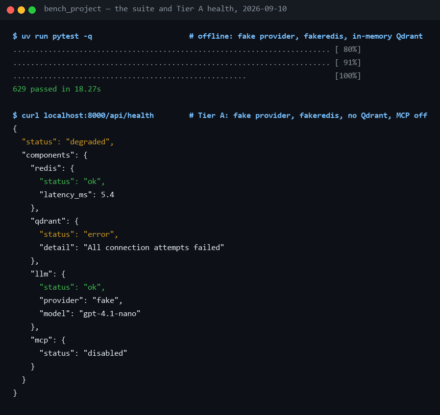

# Manual testing checklist

**How to test the assistant by hand, tier by tier — what to do and exactly
what you should see — from a laptop with nothing installed to the full
observability stack, plus what the automated suite already covers so you do
not repeat it.** The suite itself and the test-file map are in
[handbook/09](../handbook/09-testing-operations.md); every tool's exact
behaviour is in [tools.md](tools.md). Checked against the running app on
2026-09-05.

## 1. What the checklist is

Four tiers, each adding one piece of infrastructure, and everything in a
tier keeps working in the next. Work top to bottom: a failure in Tier A is a
code problem, in Tier B a container problem, in Tier C a provider problem,
in Tier D a wiring problem — the tier tells you where to look.

| Tier | Adds | Needs | What it proves |
|---|---|---|---|
| A — zero infra | nothing: fake provider, fakeredis, no Qdrant | `uv` | the whole product path, offline: streaming, tools, documents, sessions, audit |
| B — real infra | Redis and Qdrant in Docker | Docker Desktop | real RAG, persistence across restarts, graceful degradation |
| C — real model | an OpenAI key | cents | a model choosing tools on its own, real token usage and cost |
| D — observability | Jaeger, Prometheus, Grafana, optionally Logfire and Langfuse | Docker, optional accounts | one turn visible in every lens |

The automated suite covers the assertions that can be made without a
browser; this page is for clicking through the real thing.

## 2. How it works

Every tier below A swaps one fake for one real component and changes
nothing else, which is what makes a failure attributable:

| Component | Tier A | From Tier B | From Tier C |
|---|---|---|---|
| LLM | `FakeLLM` — keyword heuristics, scripted echo | same | OpenAI `gpt-4.1-nano` |
| Redis | `fakeredis://` in-process | Redis container | same |
| Qdrant | none — `search_docs` degrades to an error result | Qdrant container | same |
| MCP | real `code` server + mocked `github` server, both stdio subprocesses | same | same, or the hosted GitHub server with a PAT |
| Embeddings | `hash-512`, free | `hash-512` | `text-embedding-3-small` in the production profile |

The fake provider is not a stub that returns a fixed string. It routes on
keywords — a URL calls `fetch_url`, "PR" calls the GitHub mock, a question
ending in `?` calls `search_docs` — so every tool card, stats line and
audit row you check in Tier A is produced by the real code path, with only
the model replaced. `test_fake_parity.py` pins that the three backends make
the same routing decision.

## 3. Where it lives in this project

| File | Role |
|---|---|
| [tests/conftest.py](../../tests/conftest.py) | `HermeticSettings` (ignores your `.env`), the seeded in-memory retriever, `make_client`, the ×3 backend fixture |
| [llm/fake.py](../../src/assistant/llm/fake.py) | the keyword routing shared by `FakeLLM` and the Pydantic AI fake, so Tier A behaves the same on every backend |
| [.env.example](../../.env.example) | every variable, with the Tier A defaults commented |
| [.env.production.example](../../.env.production.example) | the Tier C and D profile: real model, real embeddings, hosted GitHub server, Jaeger |
| [docker-compose.yml](../../docker-compose.yml) | Redis and Qdrant (default), Jaeger/Prometheus/Grafana under `--profile observability` |
| [api/routes.py](../../src/assistant/api/routes.py) | `/api/health`, whose JSON the header dot renders — the first thing to read when a tier misbehaves |

What one tier change does, in order: edit `.env` → restart `uvicorn`
(settings are read at startup) → watch the header dot → `curl /api/health`
for the component that turned amber → run the tier's checklist.

## 4. How to run it

```sh
# Tier A — no .env needed at all; these are the defaults
ASSISTANT_LLM_PROVIDER=fake ASSISTANT_REDIS_URL=fakeredis:// uv run uvicorn assistant.main:app --port 8000

# Tier B — real Redis + Qdrant; remove ASSISTANT_REDIS_URL from .env (defaults to localhost:6379)
docker compose up -d
uv run uvicorn assistant.main:app --port 8000

# Tier C — real model: in .env set ASSISTANT_LLM_PROVIDER=openai, ASSISTANT_LLM_API_KEY=sk-..., ASSISTANT_LLM_MODEL=gpt-4.1-nano
uv run uvicorn assistant.main:app --port 8000

# Tier D — the dashboards; in .env set ASSISTANT_OTLP_ENDPOINT=http://localhost:4318
docker compose --profile observability up -d

# the automated side, any tier
uv run pytest -q
```

PowerShell: `$env:ASSISTANT_LLM_PROVIDER = "fake"; $env:ASSISTANT_REDIS_URL = "fakeredis://"`
once per shell, then the same `uv run` command.

| Run | Wall clock | Cost |
|---|---|---|
| the suite, `uv run pytest -q` (2026-09-05) | 24.5 s, 392 passed and 1 skipped | nothing |
| Tier A startup | ~3 s | nothing |
| Tier B, `docker compose up -d` from a warm image cache | ~10 s until Redis and Qdrant report healthy | nothing |
| one Tier C turn with a tool call | 4–5 s | $0.001–0.002 |
| the full Tier C checklist | ~10 min | a few cents |

## 5. How to see it



Line by line:

- **`392 passed, 1 skipped in 24.50s`** — the whole suite, offline: no
  network, no Docker, no keys. The skip is a documentation test that
  applies only to pages with a troubleshooting section.
- **`"status": "degraded"`** — Tier A health. Degraded is the *expected*
  state without Qdrant; it is what the amber header dot means.
- **`"redis": {"status": "ok"}`** — fakeredis answers like Redis; the
  latency is real.
- **`"qdrant": {"status": "error", "detail": "All connection attempts failed"}`**
  — the one component missing in Tier A, named, with the reason. In Tier B
  this line becomes `"ok"` with a `points` count.
- **`"llm": {"provider": "fake"}`** — no key, no model; the model name is
  the configured default and is not contacted.
- **`"mcp": {"status": "disabled"}`** — this sample was taken with MCP off;
  with the Tier A defaults it reads `"ok"` with the five dev tools listed.

## 6. Proving it — the checklists

### Tier A — zero infra

- [ ] **Streaming chat**: send `hello` → tokens stream in word by word, then
      the line solidifies. The reply is the fake echo and reports
      `(2 messages in context)`.
- [ ] **Standard mode is clean**: with the header toggle on **Standard**, a
      tool-using question shows no tool card and no stats line — only a brief
      "working…" hint, then the answer.
- [ ] **Dev mode reveals everything, retroactively**: switch to **Dev** —
      tool cards and stats lines appear on messages *already on screen*;
      nothing is re-sent. Reload: the mode persists.
- [ ] **Stats line** (Dev): duration, `first token N ms`, `1 LLM step`,
      `N→M tok (est)`, no `$` figure — the fake provider is free.
- [ ] **Details timeline**: `details` → a `final` row for an echo; after a
      tool turn also `tool_call` / `tool_result` rows with `+ms` offsets.
- [ ] **The knowledge base starts empty**: open **Documents** → "Nothing
      indexed yet". Ask `Which service generates PDF invoices?` → the
      assistant says the knowledge base is empty and asks you to add
      documents; it does not invent an answer.
- [ ] **Add a document in flight**: drop `evals/corpus/architecture/services.md`
      on the dropzone → toast `Indexed N chunks from 1 document(s)`, the file
      appears with its chunk count.
- [ ] **It is searchable immediately**: ask the same question again →
      `search_docs` card with real chunks; the answer cites
      `architecture/services.md`. This is the strongest single demo.
- [ ] **Paste instead of upload**: "or paste text", name it `runbook.md`,
      paste a heading and a line, **Add** → it appears in the list.
- [ ] **Re-upload replaces**: drop the same file again → the chunk count is
      unchanged (ids are deterministic); nothing doubles.
- [ ] **Remove**: ✕ on a document → toast, it leaves the list, and asking
      about it again returns the zero-result help rather than its content.
- [ ] **Rejected uploads explain themselves**: a `.png` → `400` with
      `unsupported type`, not a silent no-op.
- [ ] **Tools offline**: `Show latest PRs` → card `github__list_pull_requests`,
      answer quotes `#142 …`; `search code for class CustomAgent` → card
      `code__search_code` with real hits from this repository;
      `Which service generates PDF invoices?` with no Qdrant → the card shows
      `error: tool 'search_docs' failed: …` and **the turn still answers**.
- [ ] **fetch_url** *(needs internet)*: `what is
      https://github.com/thechekh/awsomequiz-streamlit about?` → card
      `fetch_url`, answer grounded in the real README; `https://github.com/thechekh`
      alone → your public repository list.
- [ ] **Off-topic honesty**: ask something the documents do not cover, without
      a URL → `search_docs` returns `No relevant chunks matched this exact
      wording.` plus the live inventory; the model may retry with different
      terms up to twice, then reports what it searched. No invented facts.
- [ ] **Health dot**: amber — hover: `redis: ok`, `qdrant: error`,
      `mcp: ok`. `curl localhost:8000/api/health` shows the same JSON.
- [ ] **Backend switcher**: custom → pydantic_ai → langgraph, one message on
      each → same behaviour, the stats-line tooltip names the new backend, the
      session survives the switch.
- [ ] **Session resume**: reload → same session id, history intact (fakeredis
      keeps it until the *server* restarts). **New session** clears.
- [ ] **Bad frame handling**: in devtools, `new WebSocket("ws://localhost:8000/chat")`
      then `ws.send("not json")` → an error frame; the socket stays usable.
- [ ] **/metrics**: `curl localhost:8000/metrics | grep assistant_` —
      `assistant_turns_total`, `assistant_tool_calls_total{status=…}` and the
      token counters present and growing.
- [ ] **Audit API**: `curl localhost:8000/api/sessions/<id>/turns` (the id is
      in the `session` frame) → JSON with per-turn stats and event timelines.

### Tier B — real infra

- [ ] **Health dot goes green**: every component `ok`; `qdrant` shows the
      `docs` collection with a points count.
- [ ] **Real RAG**: add a document, then `Which service generates PDF
      invoices?` → `[architecture/services.md — billing-service] (score …)`
      chunks; the answer cites the file.
- [ ] **A repository, by asking**: `Ingest github.com/cassidoo/todometer and
      include the code` → `ingest_repo` card, sources named
      `cassidoo/todometer/…`; then `What does the progress meter compute?` →
      `search_docs` then `repo_read_file`, and the answer quotes `Progress.jsx`.
- [ ] **Sessions survive restarts**: restart `uvicorn`, reload → history
      still there.
- [ ] **Degradation drill**: `docker stop bench_project-qdrant-1` → the dot
      turns amber within ~10 s, document questions degrade gracefully,
      everything else works; `docker start …` → green again.

The one-off ingest CLI, `uv run python -m assistant.rag.ingest evals/corpus`,
still exists for filling a knowledge base from a folder; the demo path is
the UI and `ingest_repo`, because the knowledge base is meant to start empty.

### Tier C — real model

- [ ] **Real streaming**: visibly incremental tokens; the first-token latency
      on the stats line is real network and inference time.
- [ ] **Real token usage**: `N→M tok` **without** `(est)` — OpenAI reports
      usage through `stream_options.include_usage`; on the Pydantic AI backend
      the run's usage is reported the same way since 2026-09-04.
- [ ] **Cost figure**: `~$0.000X` under the answer and
      `assistant_cost_usd_total` in `/metrics`; a turn with one tool call is
      about $0.001 on `gpt-4.1-nano`.
- [ ] **Tool choice by a real model**: `What's in PR 1 of
      thechekh/demo-payments-platform?` → the model calls
      `github__pull_request_read` on its own and reasons over the result
      (hosted server; with the mock, `What's in PR 141?`).
- [ ] **Tool-syntax salvage**: some OpenAI-compatible providers emit a tool
      call as text (`<function…>`) or abort the stream with `tool_use_failed`.
      Expected: the tool **still runs**, the log shows `retrying step (…/2)`
      or `recovered N tool call(s) from …`, and the chat never shows raw
      markup. Only after repeated failure does *"model failed to generate a
      valid tool call"* appear.
- [ ] **Provider rate limits**: hammer five or six messages quickly. Expected:
      short waits (`LLM rate limited (429) — retry …` in the log, the client
      backing off), and on exhaustion the provider's own message with which
      limit and how long — never a generic server error;
      `assistant_errors_total{kind="rate_limited"}` moves.
- [ ] **Model-typo UX**: `ASSISTANT_LLM_MODEL=does-not-exist`, restart, send
      a message → *"Model not available — check ASSISTANT_LLM_MODEL. Provider
      says: …"*; restore the real model after.
- [ ] **The read-only refusal**: `Delete every document about RAG` → refused
      in one sentence, no tool called (zero tools on the stats line).

### Tier D — observability

- [ ] **Jaeger** (http://localhost:16686): service `ai-workspace-assistant`
      → a document question shows the waterfall `agent.turn` → `llm.step` →
      `tool.execute` → `rag.retrieve` with durations and attributes.
- [ ] **Prometheus** (http://localhost:9090): target `assistant` is UP.
- [ ] **Grafana** (http://localhost:3000, no login): dashboard *AI Workspace
      Assistant* — send a few messages and watch turn rate, p50/p95, tokens
      per minute and tool calls move on the 5 s refresh.
- [ ] **Structured logs**: `ASSISTANT_LOG_JSON=true` → every line is JSON
      with `session_id` / `turn_id` / `backend`; one `turn.summary` per
      message.
- [ ] **Cloud lenses** *(accounts)*: with the Logfire token and Langfuse keys
      in `.env`, the startup log says `tracing configured (otlp=True,
      logfire=True, langfuse=True)` and the same turn appears in both —
      [logfire-langfuse.md](logfire-langfuse.md) walks it.

### Auth mode, any tier

- [ ] With `ASSISTANT_AUTH_TOKEN=s3cret`: open `http://localhost:8000/?token=s3cret`
      once → the UI works and persists the token; without it the socket
      closes with `1008`, and `/api/documents` and
      `/api/sessions/{id}/turns` return `401`. `/api/info`, `/api/health`,
      `/healthz`, `/metrics` stay open.
- [ ] `details` still loads — the UI sends the bearer header.

## 7. Showing it live

The strongest single demonstration takes ninety seconds and needs Tier A
only:

1. Open **Documents**, show "Nothing indexed yet" — *"the knowledge base
   starts empty; nothing is pre-loaded."*
2. Ask *Which service generates PDF invoices?* — *"it says it does not know,
   and asks for documents — no invention."*
3. Drop `evals/corpus/architecture/services.md` on the panel — *"indexed at
   upload, no batch job, no restart."*
4. Ask the same question — *"same question, one document later: the answer
   cites the file. Switch to Dev mode and the tool card shows the chunk it
   read."*

## 8. Reading it honestly

- **A checklist is not a test.** Nothing here fails a build; the automated
  suite is the gate, and this page exists for what a browser can see that
  an assertion cannot.
- **The fake provider proves the plumbing, not the model.** Tier A shows
  that a tool call flows end to end; whether a *model* would choose that
  tool is a Tier C question, and one bad sentence in a tool description can
  change the answer.
- **Tier C results vary.** The same question can take a different number of
  steps or tools on a different day; what should not vary is the honesty
  contract — no invented facts, refusals in one sentence.
- **UI captures are one day's.** The UI and dashboard captures in the
  handbook were taken on 2026-09-05 from the current build; re-capture
  when the header or the panels change.
- **The mock is a mock.** Tier A's `github__*` answers are canned; the hosted
  server is only proven by Tier C's health check listing its 9 tools.

## 9. Troubleshooting

| Symptom | Cause | Fix |
|---|---|---|
| tool card: `error: tool 'search_docs' failed: …` | no Qdrant (Tier A), or the container is down | expected in Tier A; in Tier B `docker compose up -d` and watch the dot |
| upload → `400` `unsupported type` | a file that is not `.md`, `.markdown`, `.txt` or `.rst` | convert or paste the text |
| the socket closes with code `1008` | auth is on and the page was opened without `?token=` | open `/?token=<secret>` once |
| chat: *"Model not available — check ASSISTANT_LLM_MODEL. Provider says: …"* | a model name typo or a model your key cannot use | fix `ASSISTANT_LLM_MODEL`, restart |
| chat: *"LLM authentication failed"* | bad or missing `ASSISTANT_LLM_API_KEY` | fix the key, restart |
| an `error` frame: `rate limit reached — too many chat turns. Try again in 60s …` | the app's own per-session limit (20 turns a minute) | wait, or raise `ASSISTANT_RATE_LIMIT_TURNS_PER_MINUTE` |
| health dot amber, `redis: error` | Docker Desktop died (it does, on this machine) | start Docker Desktop, `docker compose up -d`, restart `uvicorn` |
| the UI shows a button the docs do not mention | the served bundle is stale | `cd frontend && npm run build`, restart |

## 10. Related

- [handbook/09 — Testing & operations](../handbook/09-testing-operations.md) — the automated suite, file by file, and the operating commands
- [tools.md](tools.md) — what every tool card in these checklists should contain
- [security.md](security.md) — the refusals in Tier C, and why they are structural
- [handbook/02 — Getting started](../handbook/02-getting-started.md) — the four run modes these tiers map onto, and every `.env` variable
- [logfire-langfuse.md](logfire-langfuse.md) — Tier D's cloud lenses, verified turn by turn
